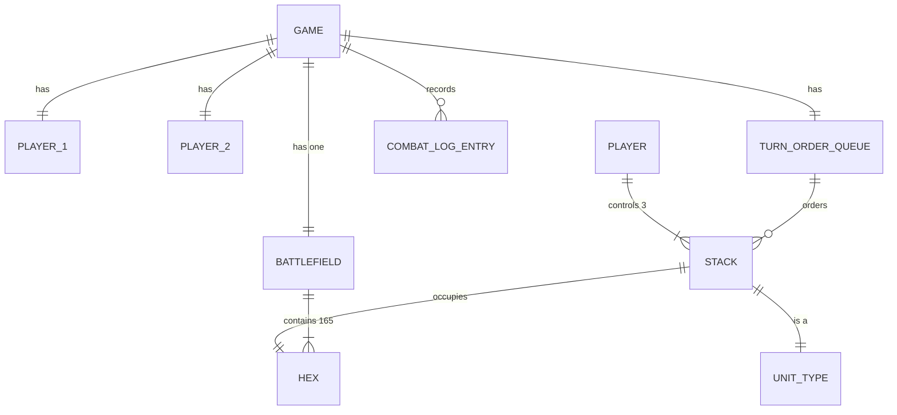
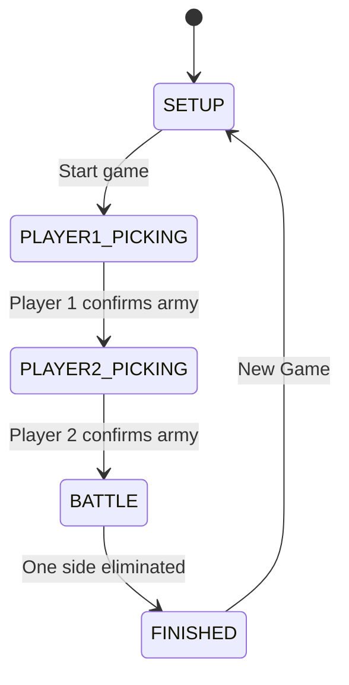
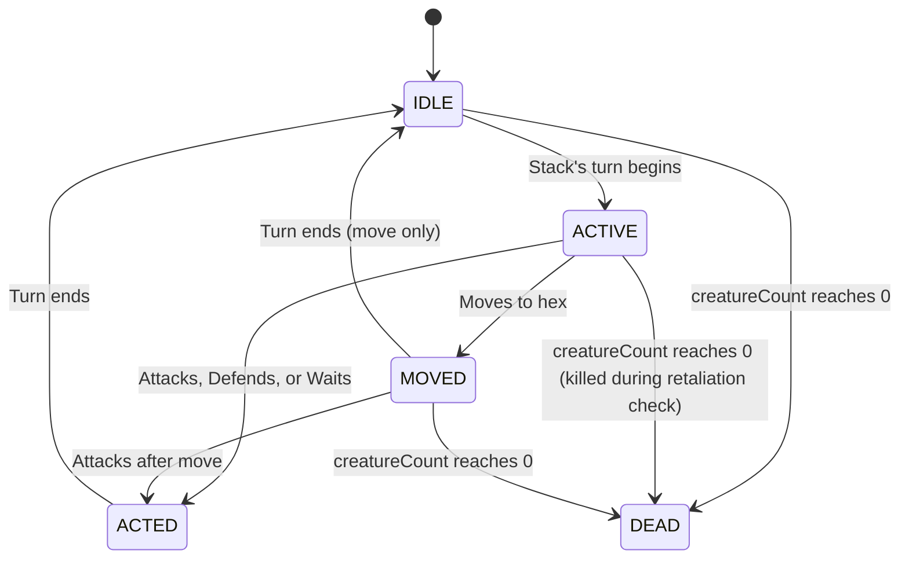
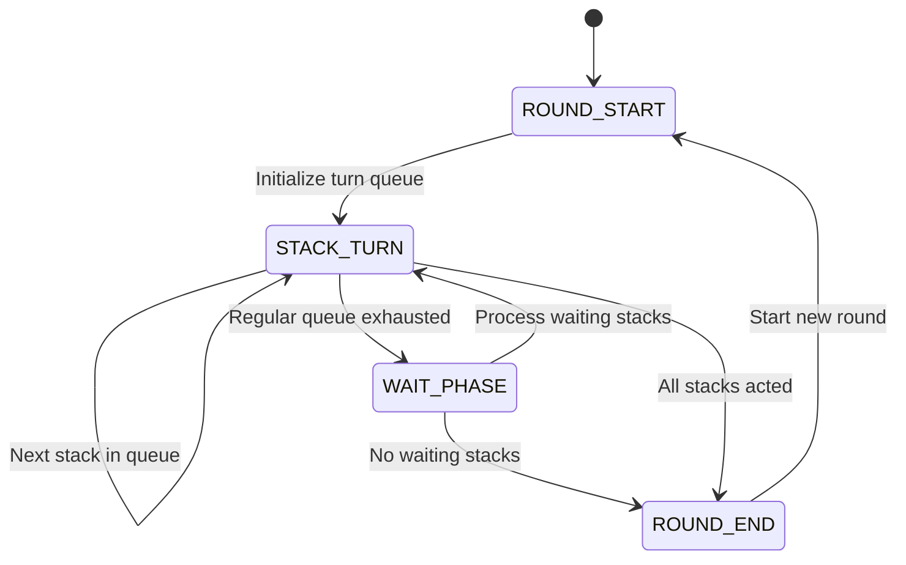

# 02 — Functional Design: HoMM3 Battle Simulation

> **Input**: [01_requirements_strategy.md](file:///c:/Projects/ai-builder-platform/.agents/blueprints/homm3-battle-sim/01_requirements_strategy.md)

---

## Section 1: Entity Data Model

### Entity: `Game`

| Attribute | Type | Constraints | Default | Description |
|:---|:---|:---|:---|:---|
| `id` | string | Unique, required | auto-generated UUID | Unique game session identifier |
| `state` | GameState enum | Required | `SETUP` | Current phase: SETUP, PLAYER1_PICKING, PLAYER2_PICKING, BATTLE, FINISHED |
| `player1` | Player | Required | — | Reference to Player 1 object |
| `player2` | Player | Required | — | Reference to Player 2 object |
| `battlefield` | Battlefield | Required | — | Reference to the battlefield grid |
| `turnOrder` | TurnOrderQueue | Required | — | Current round's turn order |
| `currentRound` | integer | >= 1 | 1 | Current round number |
| `combatLog` | CombatLogEntry[] | Required | [] | Ordered list of all combat actions |
| `winner` | Player \| null | — | null | Reference to winning player, null until game ends |

---

### Entity: `Player`

| Attribute | Type | Constraints | Default | Description |
|:---|:---|:---|:---|:---|
| `id` | string | Unique, required | "player1" or "player2" | Player identifier |
| `name` | string | Required | "Player 1" / "Player 2" | Display name |
| `color` | string | Required | "#3B82F6" / "#EF4444" | Player color (blue for P1, red for P2) |
| `stacks` | Stack[3] | Exactly 3 | — | The player's 3 battle stacks |
| `side` | "left" \| "right" | Required | P1="left", P2="right" | Deployment side of the battlefield |

---

### Entity: `UnitType`

| Attribute | Type | Constraints | Default | Description |
|:---|:---|:---|:---|:---|
| `id` | string | Unique, required | — | e.g., "pikeman", "archer", "griffin" |
| `name` | string | Required | — | Display name, e.g., "Pikeman" |
| `attack` | integer | >= 1 | — | Base attack stat |
| `defense` | integer | >= 1 | — | Base defense stat |
| `minDamage` | integer | >= 1 | — | Minimum damage per creature |
| `maxDamage` | integer | >= minDamage | — | Maximum damage per creature |
| `hp` | integer | >= 1 | — | Hit points per creature |
| `speed` | integer | >= 1 | — | Movement range in hexes |
| `initiative` | integer | >= 1 | — | Turn order priority (higher = acts first) |
| `isRanged` | boolean | Required | false | Whether this unit can perform ranged attacks |
| `shots` | integer \| null | Required if isRanged | null | Number of ranged attacks available; null for melee units |
| `icon` | string | Required | — | Visual identifier/sprite reference |

**Predefined Unit Roster** (minimum 6):

| ID | Name | ATK | DEF | DMG | HP | SPD | INIT | Ranged | Shots |
|:---|:---|:---:|:---:|:---:|:---:|:---:|:---:|:---:|:---:|
| pikeman | Pikeman | 4 | 5 | 1-3 | 10 | 4 | 8 | No | — |
| archer | Archer | 6 | 3 | 2-3 | 10 | 4 | 9 | Yes | 12 |
| griffin | Griffin | 8 | 8 | 3-6 | 25 | 6 | 12 | No | — |
| swordsman | Swordsman | 10 | 12 | 6-9 | 35 | 5 | 11 | No | — |
| monk | Monk | 12 | 7 | 10-12 | 30 | 5 | 12 | Yes | 12 |
| cavalier | Cavalier | 15 | 15 | 15-25 | 100 | 7 | 13 | No | — |

---

### Entity: `Stack`

| Attribute | Type | Constraints | Default | Description |
|:---|:---|:---|:---|:---|
| `id` | string | Unique, required | auto-generated | Unique stack identifier |
| `unitType` | UnitType | Required | — | Reference to the unit type definition |
| `owner` | Player | Required | — | Which player controls this stack |
| `creatureCount` | integer | >= 0 | Set during setup | Number of living creatures |
| `currentHp` | integer | >= 0, <= unitType.hp | unitType.hp | HP of the topmost creature |
| `position` | HexCoord | Required | — | Current hex position {col, row} |
| `hasRetaliated` | boolean | Required | false | Whether this stack has retaliated this round |
| `hasActed` | boolean | Required | false | Whether this stack has taken its turn this round |
| `isWaiting` | boolean | Required | false | Whether the stack chose to wait (placed at end of queue) |
| `isDefending` | boolean | Required | false | Whether the stack is in defend mode (+20% defense) |
| `remainingShots` | integer \| null | — | unitType.shots | Shots remaining for ranged units; null for melee |
| `isAlive` | boolean | Computed | true | `creatureCount > 0` |
| `totalHp` | integer | Computed | — | `(creatureCount - 1) * unitType.hp + currentHp` |
| `effectiveDefense` | integer | Computed | — | `isDefending ? floor(unitType.defense * 1.2) : unitType.defense` |

---

### Entity: `Battlefield`

| Attribute | Type | Constraints | Default | Description |
|:---|:---|:---|:---|:---|
| `width` | integer | Fixed: 15 | 15 | Number of hex columns |
| `height` | integer | Fixed: 11 | 11 | Number of hex rows |
| `hexes` | Hex[15][11] | Required | — | 2D array of all hexes |
| `obstacles` | HexCoord[] | Required | [] | List of obstacle hex positions |

---

### Entity: `Hex`

| Attribute | Type | Constraints | Default | Description |
|:---|:---|:---|:---|:---|
| `col` | integer | 0-14 | — | Column index |
| `row` | integer | 0-10 | — | Row index |
| `isObstacle` | boolean | Required | false | Whether the hex is impassable |
| `occupant` | Stack \| null | — | null | Stack currently on this hex |

**Hex coordinate system**: Offset coordinates with "odd-r" layout (odd rows are offset right by half a hex width).

---

### Entity: `HexCoord`

| Attribute | Type | Constraints | Default | Description |
|:---|:---|:---|:---|:---|
| `col` | integer | 0-14 | — | Column coordinate |
| `row` | integer | 0-10 | — | Row coordinate |

---

### Entity: `TurnOrderQueue`

| Attribute | Type | Constraints | Default | Description |
|:---|:---|:---|:---|:---|
| `entries` | Stack[] | Required | — | Ordered list of stacks yet to act this round |
| `activeStack` | Stack \| null | — | First entry | The stack currently taking its turn |
| `waitQueue` | Stack[] | — | [] | Stacks that chose to wait, appended after regular queue |

---

### Entity: `CombatLogEntry`

| Attribute | Type | Constraints | Default | Description |
|:---|:---|:---|:---|:---|
| `round` | integer | >= 1 | — | Round number when the action occurred |
| `actorStack` | string | Required | — | ID of the acting stack |
| `actionType` | string | Required | — | "move", "melee_attack", "ranged_attack", "retaliation", "wait", "defend", "death" |
| `targetStack` | string \| null | — | null | ID of the target stack (for attacks) |
| `damageDealt` | integer \| null | — | null | Total damage dealt |
| `creaturesKilled` | integer \| null | — | null | Number of creatures killed |
| `fromHex` | HexCoord \| null | — | null | Starting hex (for movement) |
| `toHex` | HexCoord \| null | — | null | Ending hex (for movement) |
| `message` | string | Required | — | Human-readable description |

---

## Section 2: Entity Relationships



**Relationships described**:
- A `Game` has exactly 1 `Battlefield`, 2 `Players`, 1 `TurnOrderQueue`, and many `CombatLogEntries`.
- A `Player` controls exactly 3 `Stacks`.
- A `Stack` is associated with exactly 1 `UnitType` and occupies exactly 1 `Hex` at a time.
- The `Battlefield` contains exactly 165 `Hexes` (15 × 11).
- The `TurnOrderQueue` references living `Stacks` in initiative order.

---

## Section 3: State Machines

### State Machine: `Game`



| From State | To State | Trigger | Guard Conditions | Side Effects |
|:---|:---|:---|:---|:---|
| SETUP | PLAYER1_PICKING | User clicks "Start Game" | — | Show unit roster for Player 1 |
| PLAYER1_PICKING | PLAYER2_PICKING | Player 1 clicks "Ready" | Player 1 has selected exactly 3 stacks with creature counts > 0 | Store P1 army; show unit roster for Player 2 |
| PLAYER2_PICKING | BATTLE | Player 2 clicks "Ready" | Player 2 has selected exactly 3 stacks with creature counts > 0 | Deploy all stacks on battlefield; generate obstacles; build initial turn order; start Round 1 |
| BATTLE | FINISHED | Attack results in one side having 0 living stacks | All 3 stacks of one player have creatureCount == 0 | Set `winner`; display victory screen |
| FINISHED | SETUP | User clicks "New Game" | — | Reset all game state |

---

### State Machine: `Stack`



| From State | To State | Trigger | Guard Conditions | Side Effects |
|:---|:---|:---|:---|:---|
| IDLE | ACTIVE | TurnOrderQueue advances to this stack | Stack is alive | Highlight stack; show action options |
| ACTIVE | MOVED | Player clicks valid move hex | Destination is reachable within speed | Animate movement; update position; show remaining actions |
| ACTIVE | ACTED | Player chooses Attack/Defend/Wait | Action is valid | Execute action; mark hasActed = true |
| MOVED | ACTED | Player attacks adjacent enemy after moving | Target exists in adjacent hex | Execute melee attack |
| MOVED | IDLE | Player ends turn without further action (clicked same hex/skipped) | — | Advance turn order |
| ACTED | IDLE | Action processing completes | — | Advance turn order |
| Any → | DEAD | creatureCount reaches 0 | — | Remove from battlefield; remove from turn order; check victory |

---

### State Machine: `Round`



| From State | To State | Trigger | Guard Conditions | Side Effects |
|:---|:---|:---|:---|:---|
| ROUND_START | STACK_TURN | Round begins | Living stacks exist | Sort stacks by initiative descending; reset hasRetaliated, hasActed, isWaiting, isDefending on all stacks; increment round counter |
| STACK_TURN | STACK_TURN | Active stack completes turn | More stacks in queue | Advance to next stack |
| STACK_TURN | WAIT_PHASE | Regular queue is empty | Stacks exist in wait queue | Move to processing waiting stacks (in reverse initiative: lowest first) |
| WAIT_PHASE | STACK_TURN | Waiting stack begins turn | More waiting stacks | Process next waiting stack |
| WAIT_PHASE | ROUND_END | All waiting stacks acted | — | — |
| ROUND_END | ROUND_START | — | Game is not FINISHED | Begin next round |

---

## Section 4: Granular User Stories

### Epic: `[EPIC-GRID-01]` Hex Battlefield Grid

- **US-GRID-01**: As a player, I want to see a hex grid battlefield of 15 columns × 11 rows rendered on screen so that I have a clear playing field.
- **US-GRID-02**: As a player, I want hexes occupied by stacks to display the stack's unit icon and creature count badge so that I can see army positions at a glance.
- **US-GRID-03**: As a player, I want valid movement hexes highlighted in a distinct color when my stack is selected so that I know where I can move.
- **US-GRID-04**: As a player, I want to click a highlighted hex to move my active stack there so that I can reposition my units.
- **US-GRID-05**: As a player, I want obstacle hexes rendered with a distinct visual (darker/hashed) so that I know which hexes are impassable.
- **US-GRID-06**: As a player, I want to hover over any hex to see a tooltip with coordinates and occupant info so that I can plan my moves.
- **US-GRID-07**: As a player, I want to see the path my stack will take (highlighted hexes along the route) when I hover over a valid move target so that I know the exact route.
- **US-GRID-08**: As a player, I want enemy stacks to be highlighted in a different color (e.g., red outline) when I hover over them during my attack phase so that I know which targets I can attack.

---

### Epic: `[EPIC-UNITS-02]` Unit Types & Roster

- **US-UNITS-01**: As a player, I want at least 6 distinct unit types in the roster so that I have meaningful army composition decisions.
- **US-UNITS-02**: As a player, I want each unit type to have unique stats (ATK, DEF, DMG range, HP, SPD, INIT) so that each unit plays differently.
- **US-UNITS-03**: As a player, I want at least 2 ranged unit types so that I can include ranged attackers in my army.
- **US-UNITS-04**: As a player, I want to see a unit's full stat card when I hover over or select it (in roster or on battlefield) so that I can make informed choices.
- **US-UNITS-05**: As a player, I want each unit type to have a distinct visual icon on the battlefield so that I can quickly identify unit types.

---

### Epic: `[EPIC-SETUP-03]` Army Setup / Pre-Battle Phase

- **US-SETUP-01**: As Player 1, I want to see the full unit roster and select 3 unit types for my army so that I can build my battle force.
- **US-SETUP-02**: As Player 2, I want to see the full unit roster and select 3 unit types independently so that my choices are not constrained by Player 1's picks.
- **US-SETUP-03**: As a player, I want to set the creature count for each of my 3 stacks (within a min/max range) so that I can customize army size.
- **US-SETUP-04**: As a player, I want to see a summary panel showing my selected stacks (unit type, count, key stats) so that I can review before confirming.
- **US-SETUP-05**: As a player, I want a "Ready" button that is only enabled when I have exactly 3 stacks configured so that the game enforces army rules.
- **US-SETUP-06**: As a player, I want a "Default Army" button that auto-selects 3 units with preset creature counts so that I can start quickly.
- **US-SETUP-07**: As a player, I want to be able to deselect a unit and pick a different one before confirming so that I can change my mind during setup.

---

### Epic: `[EPIC-COMBAT-04]` Core Combat Loop

- **US-COMBAT-01**: As a player, I want stacks to take turns in initiative order (highest first) so that faster units act earlier.
- **US-COMBAT-02**: As a player, I want to move my active stack up to its Speed in hexes along a valid path so that I can reposition.
- **US-COMBAT-03**: As a player, I want to melee attack an adjacent enemy stack so that I can deal damage.
- **US-COMBAT-04**: As a player, I want damage calculated using the HoMM3 formula (base damage × count, modified by ATK/DEF differential) so that combat feels authentic.
- **US-COMBAT-05**: As a player, I want my defending stack to automatically retaliate after a melee attack so that defenders counter-strike.
- **US-COMBAT-06**: As a player, I want retaliation limited to once per round per stack so that multiple attackers can gang up.
- **US-COMBAT-07**: As a player, I want ranged stacks to attack any visible enemy without adjacency so that they have range advantage.
- **US-COMBAT-08**: As a player, I want ranged stacks to consume 1 shot per ranged attack so that ammunition is finite.
- **US-COMBAT-09**: As a player, I want ranged stacks without shots to switch to melee so that they remain functional.
- **US-COMBAT-10**: As a player, I want to choose "Wait" to defer my turn to end of round so that I can time actions.
- **US-COMBAT-11**: As a player, I want to choose "Defend" to skip my turn with +20% defense so that I can protect vulnerable stacks.
- **US-COMBAT-12**: As a player, I want to move then melee attack in the same turn so that movement and combat combine.
- **US-COMBAT-13**: As a player, I want to see creatures die one-by-one as HP is depleted so that attrition is visible.
- **US-COMBAT-14**: As a player, I want to see damage numbers and kill counts after each attack so that I understand combat impact.
- **US-COMBAT-15**: As a player, I want a new round to start automatically after all stacks act so that combat flows continuously.

---

### Epic: `[EPIC-TURNORDER-05]` Turn Order & Queue Display

- **US-TURN-01**: As a player, I want to see the turn order queue displayed visually (e.g., horizontal bar of unit icons) so that I know the sequence.
- **US-TURN-02**: As a player, I want the active stack highlighted in the queue so that it's obvious whose turn it is.
- **US-TURN-03**: As a player, I want the queue to update live when stacks wait, die, or a new round begins so that it's always accurate.
- **US-TURN-04**: As a player, I want each entry in the queue to show the unit icon and player color so that I can distinguish sides.

---

### Epic: `[EPIC-PATHFINDING-06]` Hex Pathfinding

- **US-PATH-01**: As a player, I want my stack to navigate around obstacles via shortest path so that movement is automatic and optimal.
- **US-PATH-02**: As a player, I want occupied hexes (friendly or enemy) to be impassable so that stacks cannot overlap.
- **US-PATH-03**: As a player, I want unreachable hexes to be visually non-highlighted so that I know my limits.
- **US-PATH-04**: As a player, I want the pathfinding algorithm to run instantly (no perceptible delay) so that the game feels responsive.

---

### Epic: `[EPIC-VICTORY-07]` Victory & Defeat Detection

- **US-VICTORY-01**: As a player, I want the game to end immediately when all 3 of one player's stacks are dead so that there are no wasted turns.
- **US-VICTORY-02**: As a player, I want a victory screen declaring the winner with their player name and color so that the outcome is clear.
- **US-VICTORY-03**: As a player, I want a battle summary on the victory screen (surviving stacks, creatures remaining, damage dealt, rounds taken) so that I can review.
- **US-VICTORY-04**: As a player, I want a "New Game" button on the victory screen to return to setup so that I can play again.

---

### Epic: `[EPIC-UI-08]` Battle UI & Information Panels

- **US-UI-01**: As a player, I want an info panel showing the active stack's full stats during my turn so that I know my capabilities.
- **US-UI-02**: As a player, I want to hover/click an enemy stack to see its stats in the info panel so that I can evaluate threats.
- **US-UI-03**: As a player, I want action buttons (Attack, Wait, Defend) visible and contextually enabled during my turn so that I know my options.
- **US-UI-04**: As a player, I want a scrollable combat log recording every action with timestamps so that I can review the battle.
- **US-UI-05**: As a player, I want a round counter displayed so that I can track battle progression.
- **US-UI-06**: As a player, I want clear visual indicators (name, color, banner) showing whose turn it is so that hotseat transitions are obvious.
- **US-UI-07**: As a player, I want creature count badges on each stack's hex so that I see stack strength at a glance.

---

### Epic: `[EPIC-VISUALS-09]` Visual Polish & Animations

- **US-VIS-01**: As a player, I want smooth hex-to-hex movement animation so that stacks don't teleport.
- **US-VIS-02**: As a player, I want an attack animation (e.g., stack lunges toward target) so that combat feels impactful.
- **US-VIS-03**: As a player, I want floating damage numbers over hit stacks so that I see damage immediately.
- **US-VIS-04**: As a player, I want a death/fade-out animation when a stack is eliminated so that removal is clear.
- **US-VIS-05**: As a player, I want a visually distinct retaliation animation so that I can distinguish retaliations from attacks.

---

## Section 5: Business Rules

### `[RULE-01]` Initiative Turn Ordering

- **Related Stories**: US-COMBAT-01, US-TURN-01, US-TURN-02, US-TURN-03
- **Trigger**: A new round begins, or a stack's turn ends.
- **Inputs**: All living stacks and their initiative values.
- **Processing Logic**:
  1. At the start of each round, collect all living stacks.
  2. Sort stacks by `initiative` in descending order (highest acts first).
  3. If two stacks have identical initiative, Player 1's stack acts first. If both belong to the same player, the stack with the lower positional row acts first (top of battlefield first).
  4. Place sorted stacks into the `TurnOrderQueue.entries`.
  5. Set the first entry as `activeStack`.
  6. When a stack completes its turn, advance to the next entry.
- **Outputs**: An ordered queue determining the sequence of play.
- **Success Behavior**: The turn order queue is displayed and the first stack is highlighted as active.
- **Failure Behavior**: N/A — this rule always succeeds as long as living stacks exist.
- **Edge Cases**:
  - All stacks on one side are dead: the game transitions to FINISHED before the next turn.
  - A stack dies mid-round (from retaliation): it is removed from the queue immediately.
  - A stack that died was the active stack (killed by its own attack's retaliation): the turn ends and advances to the next entry.

---

### `[RULE-02]` Stack Movement

- **Related Stories**: US-COMBAT-02, US-GRID-03, US-GRID-04, US-GRID-07, US-PATH-01, US-PATH-02
- **Trigger**: Player clicks a valid, highlighted movement hex during their stack's ACTIVE state.
- **Inputs**: Active stack's position, destination hex, speed stat, battlefield state (obstacles, occupied hexes).
- **Processing Logic**:
  1. Calculate shortest path from stack's current position to destination using A* pathfinding (see Algorithm Spec [ALGO-01]).
  2. Verify path length ≤ stack's `speed` stat.
  3. Verify destination hex is not occupied and not an obstacle.
  4. Move stack: update `stack.position` to destination, clear `hex.occupant` on old hex, set `hex.occupant` on new hex.
  5. Transition stack state to MOVED.
  6. Log a "move" entry in the combat log.
- **Outputs**: Stack position updated; battlefield hex occupancy updated; combat log entry added.
- **Success Behavior**: Stack animates along the path to the new hex. Movement hexes unhighlight. Attack targets (if any adjacent enemies) highlight.
- **Failure Behavior**: If the player clicks an invalid hex (not highlighted), nothing happens (click is ignored).
- **Edge Cases**:
  - Stack has speed 0: no hexes are highlighted; stack cannot move (must attack in place, wait, or defend).
  - All reachable hexes are occupied/blocked: no movement is possible; stack can only wait, defend, or attack adjacent enemies.
  - Stack is already adjacent to an enemy: can choose to move away or attack without moving.

---

### `[RULE-03]` Melee Attack

- **Related Stories**: US-COMBAT-03, US-COMBAT-04, US-COMBAT-12, US-COMBAT-13, US-COMBAT-14
- **Trigger**: Player clicks an enemy stack in an adjacent hex (during ACTIVE or MOVED state).
- **Inputs**: Attacking stack, defending stack, their stats, defender's `hasRetaliated` flag.
- **Processing Logic**:
  1. Calculate damage dealt by attacker using Damage Formula (see [ALGO-02]).
  2. Apply damage to defender (see [RULE-05] Damage Application).
  3. Log a "melee_attack" entry with damage and kills.
  4. Check if defender is still alive.
  5. If defender is alive AND `defender.hasRetaliated == false`, trigger retaliation (see [RULE-04]).
  6. If attack + possible retaliation results in either stack dying, check victory condition ([RULE-07]).
  7. Transition attacker to ACTED state (turn ends after attack resolution).
- **Outputs**: Defender takes damage; possible retaliation; combat log updated; possible death and victory check.
- **Success Behavior**: Attack animation plays. Damage numbers float over defender. Creature count updates. If retaliation occurs, retaliation animation plays. Combat log updates.
- **Failure Behavior**: If clicked target is not adjacent or is friendly, click is ignored.
- **Edge Cases**:
  - Attacker kills all defenders in one hit: no retaliation occurs.
  - Retaliation kills the attacker: attacker's stack is eliminated. Its turn still ends normally.
  - Both stacks kill each other: attacker strikes first, defender dies, no retaliation. (Attacker calculates and applies damage first.)

---

### `[RULE-04]` Retaliation

- **Related Stories**: US-COMBAT-05, US-COMBAT-06, US-VIS-05
- **Trigger**: A defending stack survives a melee attack and has not already retaliated this round.
- **Inputs**: Defending stack (now retaliating), original attacker, their stats.
- **Processing Logic**:
  1. Verify `defender.hasRetaliated == false`.
  2. Calculate damage dealt by defender using Damage Formula ([ALGO-02]), using defender's current `creatureCount` (which may be reduced from the attack just received).
  3. Apply damage to the original attacker ([RULE-05]).
  4. Set `defender.hasRetaliated = true`.
  5. Log a "retaliation" entry in the combat log.
- **Outputs**: Original attacker takes damage; defender marked as having retaliated.
- **Success Behavior**: Retaliation animation plays. Damage numbers float. Creature count updates.
- **Failure Behavior**: If `defender.hasRetaliated == true`, no retaliation occurs (silently skipped).
- **Edge Cases**:
  - Defender has only 1 creature left with partial HP: retaliation damage is calculated with `creatureCount = 1` and may be minimal.
  - Retaliation kills the attacker: attacker stack is eliminated and removed from the battlefield.
  - Defender was reduced to a very low count and deals 0 damage after formula: minimum damage dealt is 1 (see [ALGO-02] floor).

---

### `[RULE-05]` Damage Application

- **Related Stories**: US-COMBAT-13, US-COMBAT-14
- **Trigger**: Damage is dealt to a stack (from attack or retaliation).
- **Inputs**: Target stack, damage amount (integer).
- **Processing Logic**:
  1. Subtract damage from `target.currentHp` (the topmost creature's remaining HP).
  2. If `currentHp <= 0`:
     a. The topmost creature dies — decrement `creatureCount` by 1.
     b. Carry over remaining damage: `remainingDamage = abs(currentHp)`.
     c. If `creatureCount > 0`: set `currentHp = unitType.hp`, then repeat from step 2 with `remainingDamage`.
     d. If `creatureCount == 0`: stack is dead. Set `currentHp = 0`.
  3. Calculate `creaturesKilled = originalCount - newCount`.
  4. Log kills.
- **Outputs**: Updated `creatureCount` and `currentHp` on the target stack.
- **Success Behavior**: Creature count badge updates. If stack is eliminated, death animation plays and stack is removed.
- **Failure Behavior**: N/A — damage is always applied.
- **Edge Cases**:
  - Damage exactly equals remaining HP of a single creature: creature dies, no overflow, currentHp resets to next creature's full HP.
  - Damage exceeds total HP of the stack: all creatures die; stack is eliminated.
  - Damage is 0 (theoretically possible with extreme defense advantage): no creatures die; display "0" damage.

---

### `[RULE-06]` Ranged Attack

- **Related Stories**: US-COMBAT-07, US-COMBAT-08, US-COMBAT-09
- **Trigger**: A ranged stack's player clicks on any enemy stack that is NOT adjacent (or if the ranged unit still has shots and the enemy is at any distance).
- **Inputs**: Attacking ranged stack, target enemy stack, remaining shots.
- **Processing Logic**:
  1. Verify `attacker.remainingShots > 0`.
  2. Verify attacker is a ranged unit (`unitType.isRanged == true`).
  3. If target is adjacent: this is treated as a melee attack instead ([RULE-03]).
  4. Calculate damage using Damage Formula ([ALGO-02]).
  5. Apply damage to target ([RULE-05]).
  6. Decrement `attacker.remainingShots` by 1.
  7. Log a "ranged_attack" entry.
  8. No retaliation occurs (ranged attacks do not trigger retaliation).
  9. Check victory condition ([RULE-07]).
  10. Transition attacker to ACTED state.
- **Outputs**: Target takes damage; shots decremented; no retaliation.
- **Success Behavior**: Ranged attack animation plays. Damage numbers float. Shot counter updates. Combat log updates.
- **Failure Behavior**: If stack has 0 shots remaining, ranged attack option is not available; only melee attack (on adjacent enemies) is offered.
- **Edge Cases**:
  - Ranged stack is adjacent to target and has shots: attack is treated as melee (triggers retaliation).
  - Ranged stack has exactly 1 shot left: shot is consumed; future turns will only allow melee.
  - Ranged stack has 0 shots and no adjacent enemy: stack can only move, wait, or defend.

---

### `[RULE-07]` Victory Condition Check

- **Related Stories**: US-VICTORY-01, US-VICTORY-02, US-VICTORY-03
- **Trigger**: After any damage application that results in a stack death.
- **Inputs**: Both players' stacks.
- **Processing Logic**:
  1. Count living stacks for Player 1: `p1Alive = player1.stacks.filter(s => s.isAlive).length`.
  2. Count living stacks for Player 2: `p2Alive = player2.stacks.filter(s => s.isAlive).length`.
  3. If `p1Alive == 0`: Player 2 wins.
  4. If `p2Alive == 0`: Player 1 wins.
  5. If both are 0 (impossible given sequential damage resolution, but as a safeguard): the attacker's player wins.
  6. If neither is 0: battle continues.
- **Outputs**: Game state transitions to FINISHED with `winner` set, or continues.
- **Success Behavior**: Victory screen is displayed with winner name, color, and battle summary.
- **Failure Behavior**: N/A.
- **Edge Cases**:
  - Last stack of a player dies during retaliation: the attacking player wins (the attack resolved first, killing the defender; then retaliation killed the attacker, but the defender was already dead so the attacker's side wins because the defender's side ran out first).

---

### `[RULE-08]` Wait Action

- **Related Stories**: US-COMBAT-10
- **Trigger**: Player clicks "Wait" button during their stack's turn.
- **Inputs**: Active stack.
- **Processing Logic**:
  1. Remove the active stack from its current position in the turn order queue.
  2. Set `stack.isWaiting = true`.
  3. Append the stack to the `waitQueue`.
  4. When the regular queue is exhausted, process the `waitQueue` in reverse initiative order (lowest initiative acts first among waiters).
  5. Mark `stack.hasActed = true` after the waiting stack takes its deferred turn.
- **Outputs**: Stack is repositioned in the turn order.
- **Success Behavior**: Stack's entry moves to the end of the turn order display. Turn advances to next stack.
- **Failure Behavior**: N/A.
- **Edge Cases**:
  - Stack has already waited this round: cannot wait again (Wait button disabled).
  - All remaining stacks wait: process them in reverse initiative order.
  - Only one stack left in queue: waiting has no effect (it still acts last, but it's already last).

---

### `[RULE-09]` Defend Action

- **Related Stories**: US-COMBAT-11
- **Trigger**: Player clicks "Defend" button during their stack's turn.
- **Inputs**: Active stack.
- **Processing Logic**:
  1. Set `stack.isDefending = true`.
  2. The stack's `effectiveDefense` becomes `floor(unitType.defense * 1.2)`.
  3. Mark `stack.hasActed = true`.
  4. The defending bonus persists until the start of the stack's next turn (next round).
  5. Log a "defend" entry.
- **Outputs**: Stack gains +20% defense; turn ends.
- **Success Behavior**: Defend icon/visual overlay appears on the stack. Turn advances.
- **Failure Behavior**: N/A.
- **Edge Cases**:
  - Stack defends and is then attacked: the +20% defense applies to damage calculation.
  - Stack defends in the last round before game ends: defense bonus has no effect if not attacked.

---

### `[RULE-10]` Round Transition

- **Related Stories**: US-COMBAT-15, US-UI-05
- **Trigger**: All stacks (including waiting stacks) have acted this round.
- **Inputs**: All living stacks.
- **Processing Logic**:
  1. Increment `game.currentRound` by 1.
  2. For every living stack, reset: `hasRetaliated = false`, `hasActed = false`, `isWaiting = false`, `isDefending = false`.
  3. Rebuild the turn order queue sorted by initiative (see [RULE-01]).
  4. Set the first entry as active.
- **Outputs**: New round begins with fresh turn order.
- **Success Behavior**: Round counter updates. Turn order queue refreshes. First stack is highlighted.
- **Failure Behavior**: N/A.
- **Edge Cases**:
  - All stacks on one side died during the round: game transitions to FINISHED before new round starts.

---

### `[RULE-11]` Army Setup Validation

- **Related Stories**: US-SETUP-01, US-SETUP-02, US-SETUP-03, US-SETUP-05
- **Trigger**: Player clicks "Ready" during army setup.
- **Inputs**: Player's selected stacks (unit types and creature counts).
- **Processing Logic**:
  1. Verify exactly 3 stacks are selected.
  2. Verify each stack has a valid unit type from the roster.
  3. Verify each stack's creature count is >= 1 and <= a defined maximum (e.g., 99).
  4. Allow duplicate unit types (player can pick 3 of the same unit if desired).
- **Outputs**: Army is confirmed and locked.
- **Success Behavior**: Army panel shows confirmed status; game transitions to next player's setup (or to BATTLE if both players are done).
- **Failure Behavior**: "Ready" button is disabled until validation passes. Visual cues show which requirements are unmet.
- **Edge Cases**:
  - Player tries to select more than 3 stacks: the 4th selection replaces the earliest or is blocked.
  - Player sets creature count to 0: validation fails; "Ready" button stays disabled.

---

### `[RULE-12]` Battlefield Obstacle Generation

- **Related Stories**: US-GRID-05
- **Trigger**: Game transitions from PLAYER2_PICKING to BATTLE.
- **Inputs**: Battlefield dimensions (15×11).
- **Processing Logic**:
  1. Generate a set of obstacle hexes. Place 6-12 obstacles randomly.
  2. Obstacles must NOT be placed in the deployment columns (columns 0-1 for Player 1, columns 13-14 for Player 2).
  3. Obstacles must not block all paths between the two sides (ensure connectivity).
  4. Mark selected hexes as `isObstacle = true`.
- **Outputs**: Battlefield has obstacles placed.
- **Success Behavior**: Obstacle hexes display distinct visuals.
- **Failure Behavior**: N/A (generation always succeeds; retry if connectivity check fails).
- **Edge Cases**:
  - Random placement blocks all paths: regenerate obstacles until at least one path exists between left and right deployment zones.

---

### `[RULE-13]` Stack Deployment

- **Related Stories**: US-SETUP-01, US-SETUP-02
- **Trigger**: Both players confirm their armies; game transitions to BATTLE.
- **Inputs**: Player 1's 3 stacks, Player 2's 3 stacks, battlefield grid.
- **Processing Logic**:
  1. Player 1's stacks deploy in column 0, rows: 1, 5, 9 (evenly spaced vertically).
  2. Player 2's stacks deploy in column 14, rows: 1, 5, 9 (mirrored).
  3. Set each stack's `position` to the assigned hex.
  4. Set each hex's `occupant` to the corresponding stack.
- **Outputs**: All 6 stacks placed on the battlefield.
- **Success Behavior**: Stacks appear at their starting positions with unit icons and creature count badges.
- **Failure Behavior**: N/A (deployment positions are guaranteed to be obstacle-free per [RULE-12]).
- **Edge Cases**:
  - None — deployment positions are fixed and guaranteed valid.

---

### `[RULE-14]` Move-Then-Attack Combo

- **Related Stories**: US-COMBAT-12
- **Trigger**: During an active stack's turn, the player clicks on an enemy stack that is not adjacent but is within movement range + 1 hex adjacency.
- **Inputs**: Active stack, target enemy stack, battlefield state.
- **Processing Logic**:
  1. Find all hexes adjacent to the target enemy stack.
  2. Filter to hexes that are unoccupied, not obstacles, and reachable within the active stack's speed.
  3. If at least one such hex exists: auto-move to the nearest valid adjacent hex (shortest path), then execute melee attack.
  4. This consumes the stack's movement AND attack for the turn.
- **Outputs**: Stack moves to an adjacent hex of the target and performs a melee attack.
- **Success Behavior**: Movement animation plays, followed immediately by attack animation.
- **Failure Behavior**: If no adjacent hex is reachable, the stack cannot attack that target this turn (it can only move closer).
- **Edge Cases**:
  - Multiple adjacent hexes available: choose the one with the shortest path from the current position.
  - Target is adjacent already: no movement needed, just attack.

---

## Section 6: Algorithm Specifications

### `[ALGO-01]` A* Hex Pathfinding

**Purpose**: Calculate the shortest path between two hexes on the battlefield, avoiding obstacles and occupied hexes.

**Inputs**:
- `start`: HexCoord — the starting hex.
- `goal`: HexCoord — the destination hex.
- `battlefield`: Battlefield — the current grid state.
- `allowOccupiedGoal`: boolean — if true, the goal hex can be occupied (used for attack targeting to find adjacent hexes).

**Pseudocode**:
```
function findPath(start, goal, battlefield, allowOccupiedGoal = false):
    openSet = PriorityQueue()
    openSet.add(start, priority = 0)
    cameFrom = {}
    gScore = { start: 0 }
    fScore = { start: hexDistance(start, goal) }

    while openSet is not empty:
        current = openSet.popLowest()

        if current == goal:
            return reconstructPath(cameFrom, current)

        for each neighbor in getHexNeighbors(current):
            // Skip invalid hexes
            if neighbor is out of bounds: continue
            if neighbor.isObstacle: continue
            if neighbor.occupant != null AND neighbor != goal: continue
            if neighbor == goal AND neighbor.occupant != null AND NOT allowOccupiedGoal: continue

            tentativeG = gScore[current] + 1  // uniform cost: 1 per hex
            if tentativeG < gScore.getOrDefault(neighbor, INFINITY):
                cameFrom[neighbor] = current
                gScore[neighbor] = tentativeG
                fScore[neighbor] = tentativeG + hexDistance(neighbor, goal)
                openSet.addOrUpdate(neighbor, fScore[neighbor])

    return null  // no path found

function hexDistance(a, b):
    // Convert offset coords to cube coords, then compute Manhattan distance / 2
    aCube = offsetToCube(a)
    bCube = offsetToCube(b)
    return max(abs(aCube.x - bCube.x), abs(aCube.y - bCube.y), abs(aCube.z - bCube.z))

function getHexNeighbors(hex):
    // For odd-r offset layout:
    if hex.row is odd:
        directions = [(+1,0), (+1,-1), (0,-1), (-1,0), (0,+1), (+1,+1)]
    else:
        directions = [(+1,0), (0,-1), (-1,-1), (-1,0), (-1,+1), (0,+1)]
    return [HexCoord(hex.col + dc, hex.row + dr) for (dc, dr) in directions
            if inBounds(hex.col + dc, hex.row + dr)]

function reconstructPath(cameFrom, current):
    path = [current]
    while current in cameFrom:
        current = cameFrom[current]
        path.prepend(current)
    return path
```

**Outputs**: An ordered array of HexCoords from start to goal (inclusive), or null if no path exists.

**Complexity**: O(n log n) where n = number of hexes (165). In practice, near-instant.

**Worked Example**:
- Start: (0, 5), Goal: (3, 5). No obstacles.
- Iteration 1: Expand (0,5). Neighbors: (1,4), (1,5), (1,6), etc. All get gScore=1.
- Iteration 2: Expand (1,5) (closest to goal). Neighbors include (2,5). gScore=2.
- Iteration 3: Expand (2,5). Neighbors include (3,5). gScore=3.
- Goal reached. Path: [(0,5), (1,5), (2,5), (3,5)]. Length: 3 hexes.

---

### `[ALGO-02]` HoMM3 Damage Formula

**Purpose**: Calculate the damage dealt by one stack attacking another.

**Inputs**:
- `attacker`: Stack (with unitType stats and creatureCount)
- `defender`: Stack (with unitType stats, effective defense)
- Returns: `{damage: integer, creaturesKilled: integer}`

**Pseudocode**:
```
function calculateDamage(attacker, defender):
    // Step 1: Random base damage per creature
    baseDamagePerCreature = random(attacker.unitType.minDamage, attacker.unitType.maxDamage)

    // Step 2: Total base damage (multiply by creature count)
    totalBaseDamage = baseDamagePerCreature * attacker.creatureCount

    // Step 3: Attack/Defense modifier
    atkStat = attacker.unitType.attack
    defStat = defender.effectiveDefense  // includes Defend bonus if active

    if atkStat > defStat:
        difference = atkStat - defStat
        modifier = 1 + (difference * 0.05)        // +5% per point
        modifier = min(modifier, 4.0)               // cap at +300% (4x)
    else if defStat > atkStat:
        difference = defStat - atkStat
        modifier = 1 - (difference * 0.025)         // -2.5% per point
        modifier = max(modifier, 0.30)              // cap at -70% (0.3x)
    else:
        modifier = 1.0                               // equal stats, no modifier

    // Step 4: Apply modifier
    finalDamage = floor(totalBaseDamage * modifier)

    // Step 5: Minimum damage of 1
    finalDamage = max(finalDamage, 1)

    // Step 6: Calculate creatures killed
    creaturesKilled = calculateCreaturesKilled(defender, finalDamage)

    return { damage: finalDamage, creaturesKilled: creaturesKilled }

function calculateCreaturesKilled(defender, damage):
    remainingDamage = damage
    killed = 0
    currentHp = defender.currentHp

    while remainingDamage > 0 AND (killed + (defender.creatureCount - killed)) > killed:
        if remainingDamage >= currentHp:
            remainingDamage -= currentHp
            killed += 1
            currentHp = defender.unitType.hp  // next creature starts at full HP
        else:
            break  // partial damage to top creature

        if killed >= defender.creatureCount:
            break  // all creatures dead

    return killed
```

**Outputs**: `{ damage: integer, creaturesKilled: integer }`

**Complexity**: O(k) where k = creatures killed. Typically negligible.

**Worked Example**:
- Attacker: 10 Pikemen (ATK 4, DMG 1-3). Defender: 5 Swordsmen (DEF 12, HP 35).
- Random base damage: 2 (rolled between 1-3).
- Total base: 2 × 10 = 20.
- ATK (4) < DEF (12): difference = 8. Modifier = 1 - (8 × 0.025) = 0.80.
- Final damage: floor(20 × 0.80) = 16.
- Apply to defender: currentHp = 35. 16 < 35, so 0 creatures killed. Remaining HP = 35 - 16 = 19.
- Result: `{ damage: 16, creaturesKilled: 0 }`

---

### `[ALGO-03]` Reachable Hexes Calculation

**Purpose**: Determine all hexes a stack can reach within its speed, for movement highlighting.

**Inputs**:
- `stack`: Stack (position, speed)
- `battlefield`: Battlefield

**Pseudocode**:
```
function getReachableHexes(stack, battlefield):
    reachable = {}
    queue = Queue()
    queue.add(stack.position, distance = 0)
    visited = { stack.position: 0 }

    while queue is not empty:
        current, dist = queue.pop()

        if dist > 0:  // don't include starting hex
            reachable[current] = dist

        if dist < stack.unitType.speed:
            for each neighbor in getHexNeighbors(current):
                if neighbor is out of bounds: continue
                if neighbor.isObstacle: continue
                if neighbor.occupant != null: continue  // can't pass through occupied
                if neighbor in visited AND visited[neighbor] <= dist + 1: continue

                visited[neighbor] = dist + 1
                queue.add(neighbor, dist + 1)

    return reachable  // map of HexCoord -> distance
```

**Outputs**: A map of all reachable hexes with their distance from the stack.

**Complexity**: O(n) where n = hexes within speed range. Very fast.

**Worked Example**:
- Stack at (7, 5) with speed 2. No obstacles nearby.
- Distance 1: 6 neighbors of (7,5).
- Distance 2: neighbors of those 6, minus already visited. Up to ~18 hexes total but bounded by grid edges.

---

## Section 7: UI Interaction Flows

### Flow: Army Setup (Per Player)

| Step | User Action | System Response | State Change | Visual Feedback |
|:---|:---|:---|:---|:---|
| 1 | Views unit roster | Display all 6 unit types with stat cards | — | Roster panel visible with selectable unit cards |
| 2 | Clicks a unit type | Mark unit as selected for slot 1/2/3 (fills next empty slot) | selectedUnits array updated | Unit card gains selection border; appears in "Your Army" panel |
| 3 | Sets creature count via input/slider | Validate count >= 1 and <= 99 | creatureCount updated | Counter displays the set number |
| 4 | Clicks a selected unit to deselect | Remove from selected slots | selectedUnits array updated | Unit card loses selection border; removed from army panel |
| 5 | Clicks "Default Army" | Auto-fill 3 predetermined units with preset counts | selectedUnits fully populated | All 3 slots filled in army panel |
| 6 | Clicks "Ready" | Validate 3 stacks selected with counts > 0 | Player army confirmed; game state advances | Button grays out; "Waiting for opponent" / transition to Player 2's setup |

---

### Flow: Combat Turn (Active Stack)

| Step | User Action | System Response | State Change | Visual Feedback |
|:---|:---|:---|:---|:---|
| 1 | Turn begins | Highlight active stack; show action panel; highlight reachable hexes | Stack state → ACTIVE | Active stack pulses; reachable hexes glow; action buttons enabled |
| 2a (Move) | Hovers over reachable hex | Calculate & display path preview | — | Path hexes highlighted in sequence |
| 2b (Move) | Clicks reachable hex | Execute movement via [RULE-02] | Stack state → MOVED; position updated | Movement animation hex-by-hex; clear movement highlights; show attack highlights on adjacent enemies |
| 3a (Melee) | Clicks adjacent enemy stack | Execute melee attack via [RULE-03] then retaliation via [RULE-04] | Damage applied; stack state → ACTED | Attack animation; damage numbers; kill count; retaliation animation if applicable |
| 3b (Ranged) | Clicks non-adjacent enemy (ranged unit with shots) | Execute ranged attack via [RULE-06] | Damage applied; shots decremented; stack state → ACTED | Projectile animation; damage numbers; kill count |
| 4a (Wait) | Clicks "Wait" button | Execute wait via [RULE-08] | Stack moved to end of queue | Stack entry moves in turn order display |
| 4b (Defend) | Clicks "Defend" button | Execute defend via [RULE-09] | isDefending = true; stack state → ACTED | Shield icon overlay on stack; turn advances |
| 5 | Turn ends | Advance turn order to next stack | Next stack becomes ACTIVE | Previous stack unhighlights; next stack highlights |

---

### Flow: Victory

| Step | User Action | System Response | State Change | Visual Feedback |
|:---|:---|:---|:---|:---|
| 1 | (Automatic) Last enemy stack dies | Trigger [RULE-07]; transition to FINISHED | game.state → FINISHED; winner set | Battle fades; victory overlay appears |
| 2 | Views victory screen | Display winner name, color, battle summary | — | Winner declared with color banner; summary table shows surviving stacks, kills, rounds |
| 3 | Clicks "New Game" | Reset all game state | game.state → SETUP | Return to setup screen |

---

## Section 8: Error & Edge Case Catalog

| ID | Scenario | Expected Behavior | Related Rules |
|:---|:---|:---|:---|
| `[EDGE-01]` | Player clicks on a hex that is not highlighted (invalid move) | Click is ignored. No state change. | RULE-02 |
| `[EDGE-02]` | Player clicks on friendly stack during attack phase | Click is ignored. No attack occurs. | RULE-03, RULE-06 |
| `[EDGE-03]` | Player tries to move to an occupied hex | Hex is not highlighted as reachable; click ignored. | RULE-02, ALGO-01 |
| `[EDGE-04]` | Ranged stack has 0 shots left and no adjacent enemy | Stack can only move, wait, or defend. Attack button is disabled. | RULE-06 |
| `[EDGE-05]` | All 3 of a player's stacks die from a single retaliatory strike | Victory check triggers immediately; game ends. | RULE-04, RULE-07 |
| `[EDGE-06]` | All stacks choose to Wait in a round | Wait queue processes in reverse initiative. Round still completes normally. | RULE-08 |
| `[EDGE-07]` | A stack dies mid-turn from retaliation | The dying stack's turn ends. It is removed from the turn order queue. | RULE-03, RULE-04 |
| `[EDGE-08]` | Player sets creature count to 0 during setup | "Ready" button stays disabled. Validation message shown. | RULE-11 |
| `[EDGE-09]` | Player selects the same unit type for all 3 stacks | Allowed. No restriction on duplicate unit types. | RULE-11 |
| `[EDGE-10]` | Obstacle generation blocks all paths between sides | Regenerate obstacles until connectivity is ensured. | RULE-12 |
| `[EDGE-11]` | Stack is surrounded by obstacles and enemy stacks (can't move) | Stack can only attack adjacent enemies, wait, or defend. Movement is unavailable. | RULE-02, ALGO-03 |
| `[EDGE-12]` | Damage formula produces 0 (extreme defense advantage) | Minimum damage of 1 is applied. | ALGO-02 |
| `[EDGE-13]` | Active stack has no valid actions (no move targets, no attack targets, already waited) | Stack must defend (only available action). | RULE-09 |
| `[EDGE-14]` | A waiting stack is killed before its deferred turn | Stack is removed from wait queue. Its deferred turn is skipped. | RULE-08, RULE-05 |

---

## Section 9: Application Constraints

- **C1**: Each player MUST have exactly 3 stacks. No more, no fewer.
- **C2**: Creature count per stack MUST be between 1 and 99 (inclusive).
- **C3**: The battlefield size is ALWAYS 15 columns × 11 rows. It is not configurable.
- **C4**: Turn order is ALWAYS determined by initiative stat (descending). This cannot be changed.
- **C5**: A stack can NEVER occupy the same hex as another stack (friendly or enemy).
- **C6**: Obstacles can NEVER be placed in deployment columns (0-1 for P1, 13-14 for P2).
- **C7**: A stack can NEVER attack a friendly stack.
- **C8**: A stack ALWAYS gets exactly one turn per round (unless it waits, in which case it still gets one turn — deferred).
- **C9**: The minimum damage from any attack is ALWAYS 1 (never 0).
- **C10**: Ranged attacks NEVER trigger retaliation (only melee triggers retaliation).
- **C11**: The game MUST end when all stacks of one player are eliminated. No other end condition exists.

---

## Section 10: Pending Decisions

| ID | Question | Impact | Proposed Default |
|:---|:---|:---|:---|
| `[PENDING-01]` | Should players be able to pick the same unit type as their opponent, or should the roster be a draft (exclusive picks)? | Affects army diversity and strategic depth during setup. | Allow duplicates — both players can pick any unit type regardless of opponent's choice. |
| `[PENDING-02]` | Should there be a "point buy" budget system for creature counts, or free selection within min/max? | A budget system would enforce balance; free selection allows creative imbalance. | Free selection within 1-99 per stack. Balance is the players' responsibility. |
| `[PENDING-03]` | Should the ranged attack from an adjacent hex always be treated as melee, or should the player choose? | Affects ranged unit tactics. HoMM3 treats adjacent ranged as melee (half damage, with retaliation). | Adjacent ranged is always melee (matching HoMM3 behavior), but without the half-damage penalty (per scope exclusions: simplified ranged model). |
| `[PENDING-04]` | How many obstacles should be generated? Fixed count or random range? | Affects battlefield variety and pathfinding complexity. | Random range: 6-12 obstacles per battle. |
