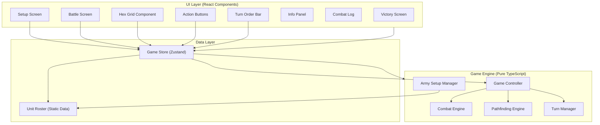
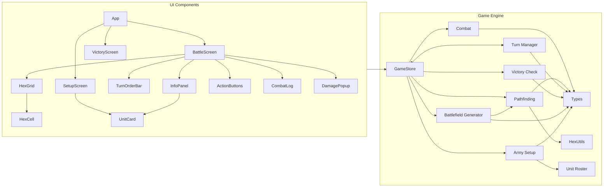

# 04 — Technical Architecture: HoMM3 Battle Simulation

> **Inputs**: [01_requirements_strategy.md](file:///c:/Projects/ai-builder-platform/.agents/blueprints/homm3-battle-sim/01_requirements_strategy.md), [02_functional_design.md](file:///c:/Projects/ai-builder-platform/.agents/blueprints/homm3-battle-sim/02_functional_design.md), [03_nfr.md](file:///c:/Projects/ai-builder-platform/.agents/blueprints/homm3-battle-sim/03_nfr.md)

---

## Section 1: Tech Stack Selection

| Layer | Technology | Version | Justification (tied to NFR) |
|:---|:---|:---|:---|
| Frontend Framework | **React 19** | 19.x | Requested framework with a mature ecosystem and predictable component model. On a 165-hex board, React stays within the interaction budget when paired with granular store subscriptions and no heavyweight UI kit. |
| Styling | **Vanilla CSS** with CSS Custom Properties | — | Zero runtime overhead. CSS Grid/Flexbox for layout. Custom properties for theming (player colors, hex states). No external CSS framework needed — keeps bundle minimal. |
| Language | **TypeScript** | 5.x | Strict mode enforced per NFR Section 6. Prevents state bugs through compile-time type checking. All entities from functional design are typed as interfaces. |
| State Management | **Zustand** with selector hooks | 5.x | Lightweight external store with fine-grained subscriptions. Keeps `AppState` centralized without broad rerenders that a Context-only approach would cause during hover/highlight updates. |
| Build Tool | **Vite** | 6.x | Instant dev server with Fast Refresh. Production build uses Rollup for tree-shaking and keeps the React bundle compact. |
| Testing | **Vitest + React Testing Library** | 2.x | Native Vite integration for engine tests plus DOM-level component tests for React screens and interactions. Same TypeScript config — no dual tooling. |
| Deployment | **Static hosting** (Vercel / Netlify / GitHub Pages) | — | No server needed. Static HTML/JS/CSS served via CDN. Meets the LCP <2s target via edge caching. |
| Package Manager | **npm** | 10.x | Standard, no exotic tooling required. |

**Alternatives Considered**:
- **Preact**: Smaller runtime, but the requirement is explicitly React and full React ecosystem compatibility is more valuable than shaving a few KB.
- **Vue 3**: Good fit technically, but standardizing on React keeps component patterns, testing utilities, and hiring expectations simpler.
- **Canvas/WebGL**: Considered for rendering the hex grid. Rejected because SVG/CSS hex grids are simpler, more accessible, and sufficient for 165 hexes. Canvas provides no benefit at this scale and complicates click detection.
- **Context + useReducer / Redux Toolkit**: Context-only state would rerender large subtrees during frequent hover updates; Redux Toolkit adds more boilerplate than this app needs. Zustand keeps the store small and selector-driven.

---

## Section 2: High-Level Architecture



### Component Descriptions

- **UI Layer**: React function components responsible for rendering and user interaction. No business logic. Components subscribe to the Game Store through selector hooks and dispatch store actions.
- **Game Engine**: Pure TypeScript modules containing all game logic. Framework-agnostic — could theoretically work with any UI. Handles combat resolution, pathfinding, turn management, and army setup.
- **Data Layer**: The single source of truth. The Game Store holds the reactive game state; the Unit Roster is static, read-only data defining all available unit types.

**Key Rule**: The Engine layer NEVER imports from the UI layer or the store. The UI layer reads from the store and dispatches actions. The store invokes engine functions and commits the resulting state updates.

---

## Section 3: Core Interface Definitions

```typescript
// ===== ENUMS =====

enum GameState {
  SETUP = 'SETUP',
  PLAYER1_PICKING = 'PLAYER1_PICKING',
  PLAYER2_PICKING = 'PLAYER2_PICKING',
  BATTLE = 'BATTLE',
  FINISHED = 'FINISHED',
}

enum ActionType {
  MOVE = 'move',
  MELEE_ATTACK = 'melee_attack',
  RANGED_ATTACK = 'ranged_attack',
  RETALIATION = 'retaliation',
  WAIT = 'wait',
  DEFEND = 'defend',
  DEATH = 'death',
}

enum PlayerSide {
  LEFT = 'left',
  RIGHT = 'right',
}

// ===== COORDINATES =====

interface HexCoord {
  col: number; // 0-14
  row: number; // 0-10
}

// ===== UNIT TYPE (Static Data) =====

interface UnitType {
  id: string;          // e.g., "pikeman"
  name: string;        // e.g., "Pikeman"
  attack: number;      // >= 1
  defense: number;     // >= 1
  minDamage: number;   // >= 1
  maxDamage: number;   // >= minDamage
  hp: number;          // >= 1
  speed: number;       // >= 1
  initiative: number;  // >= 1, higher = acts first
  isRanged: boolean;
  shots: number | null; // null for melee units
  icon: string;        // SVG path or emoji identifier
}

// ===== STACK (Runtime Entity) =====

interface Stack {
  id: string;
  unitType: UnitType;
  owner: Player;
  creatureCount: number;    // >= 0
  currentHp: number;        // 0 to unitType.hp
  position: HexCoord;
  hasRetaliated: boolean;
  hasActed: boolean;
  isWaiting: boolean;
  isDefending: boolean;
  remainingShots: number | null;
}

// Computed helpers (pure functions, not stored):
// isAlive(stack): boolean => stack.creatureCount > 0
// totalHp(stack): number => (stack.creatureCount - 1) * stack.unitType.hp + stack.currentHp
// effectiveDefense(stack): number => stack.isDefending ? Math.floor(stack.unitType.defense * 1.2) : stack.unitType.defense

// ===== PLAYER =====

interface Player {
  id: string;           // "player1" | "player2"
  name: string;         // "Player 1" | "Player 2"
  color: string;        // hex color code
  stacks: Stack[];      // exactly 3
  side: PlayerSide;
}

// ===== BATTLEFIELD =====

interface Hex {
  col: number;
  row: number;
  isObstacle: boolean;
  occupant: Stack | null;
}

interface Battlefield {
  width: 15;
  height: 11;
  hexes: Hex[][];  // [col][row]
  obstacles: HexCoord[];
}

// ===== TURN ORDER =====

interface TurnOrderQueue {
  entries: Stack[];       // ordered by initiative, living stacks only
  activeIndex: number;    // index of current active stack
  waitQueue: Stack[];     // stacks that chose to wait
}

// ===== COMBAT LOG =====

interface CombatLogEntry {
  round: number;
  actorStackId: string;
  actionType: ActionType;
  targetStackId: string | null;
  damageDealt: number | null;
  creaturesKilled: number | null;
  fromHex: HexCoord | null;
  toHex: HexCoord | null;
  message: string;
}

// ===== DAMAGE RESULT =====

interface DamageResult {
  damage: number;
  creaturesKilled: number;
}

// ===== PATH RESULT =====

interface PathResult {
  path: HexCoord[];   // ordered start to goal
  length: number;     // number of steps
}

// ===== ARMY SELECTION (Setup Phase) =====

interface ArmySlot {
  unitType: UnitType | null;
  creatureCount: number;
}

interface ArmySelection {
  slots: [ArmySlot, ArmySlot, ArmySlot]; // exactly 3
  isReady: boolean; // all slots filled with count >= 1
}

// ===== BATTLE SUMMARY (Victory Screen) =====

interface BattleSummary {
  winner: Player;
  loser: Player;
  totalRounds: number;
  survivingStacks: Array<{
    unitType: UnitType;
    remainingCreatures: number;
    remainingHp: number;
  }>;
  totalDamageDealt: { player1: number; player2: number };
  totalCreaturesKilled: { player1: number; player2: number };
}
```

---

## Section 4: State Management Specification

### State Shape

```typescript
interface AppState {
  // Game phase
  gameState: GameState;

  // Players
  player1: Player;
  player2: Player;

  // Setup phase
  player1Selection: ArmySelection;
  player2Selection: ArmySelection;

  // Battlefield
  battlefield: Battlefield;

  // Combat state
  turnOrder: TurnOrderQueue;
  currentRound: number;
  combatLog: CombatLogEntry[];

  // Result
  winner: Player | null;
  battleSummary: BattleSummary | null;

  // UI state (not game logic)
  highlightedHexes: Map<string, 'reachable' | 'attack' | 'path'>;
  hoveredHex: HexCoord | null;
  selectedStack: Stack | null;
  activeStack: Stack | null;
}
```

### Actions / Mutations

```typescript
type GameAction =
  // Setup actions
  | { type: 'SELECT_UNIT'; payload: { playerNumber: 1 | 2; slotIndex: 0 | 1 | 2; unitType: UnitType } }
  | { type: 'SET_CREATURE_COUNT'; payload: { playerNumber: 1 | 2; slotIndex: 0 | 1 | 2; count: number } }
  | { type: 'DESELECT_UNIT'; payload: { playerNumber: 1 | 2; slotIndex: 0 | 1 | 2 } }
  | { type: 'CONFIRM_ARMY'; payload: { playerNumber: 1 | 2 } }
  | { type: 'LOAD_DEFAULT_ARMY'; payload: { playerNumber: 1 | 2 } }

  // Battle actions
  | { type: 'MOVE_STACK'; payload: { stackId: string; targetHex: HexCoord } }
  | { type: 'MELEE_ATTACK'; payload: { attackerStackId: string; defenderStackId: string } }
  | { type: 'RANGED_ATTACK'; payload: { attackerStackId: string; defenderStackId: string } }
  | { type: 'WAIT' }
  | { type: 'DEFEND' }

  // Game lifecycle
  | { type: 'START_GAME' }
  | { type: 'NEW_GAME' }

  // UI actions
  | { type: 'HOVER_HEX'; payload: { hex: HexCoord | null } }
  | { type: 'CLICK_HEX'; payload: { hex: HexCoord } };
```

### Derived / Computed State

```typescript
// These are implemented as Zustand selectors / pure selector helpers:
// activeStack: derived from turnOrder.entries[turnOrder.activeIndex]
// activePlayerName: derived from activeStack.owner.name
// reachableHexes: derived from getReachableHexes(activeStack, battlefield)
// attackableStacks: derived from getAttackableTargets(activeStack, battlefield)
// player1AliveCount: derived from player1.stacks.filter(s => isAlive(s)).length
// player2AliveCount: derived from player2.stacks.filter(s => isAlive(s)).length
// isGameOver: derived from player1AliveCount === 0 || player2AliveCount === 0
// canWait: derived from activeStack && !activeStack.isWaiting && !activeStack.hasActed
// canDefend: derived from activeStack && !activeStack.hasActed
// canRangedAttack: derived from activeStack?.unitType.isRanged && (activeStack?.remainingShots ?? 0) > 0
```

---

## Section 5: Data Architecture

### 5a: Client-Side Data Structures

There is no database. All data exists in the browser's JavaScript runtime memory.

**Static data** (loaded at startup, never mutated):
- `UNIT_ROSTER: UnitType[]` — the 6 predefined unit types with all their stats. Defined as a constant array in a `data/units.ts` file.

**Runtime data** (the reactive game state):
- The `AppState` object defined above, managed by a single Zustand store in `gameStore.ts`. Components read it through selector hooks to minimize rerenders.

**Persistence**: None. Game state is lost on page refresh. This is acceptable per NFR Section 5.

### 5b: Caching Strategy

No caching layer. The pathfinding and reachable hex calculations are fast enough (<5ms per NFR) to recompute on every interaction. No memoization needed for the 165-hex grid.

---

## Section 6: API Specification

**N/A** — This is a purely client-side application. No API endpoints exist. No network requests are made during gameplay. The app is served as static files.

---

## Section 7: Module Dependency Architecture

### File Structure

```
src/
├── lib/
│   ├── data/
│   │   └── units.ts                 # UNIT_ROSTER constant
│   ├── engine/
│   │   ├── combat.ts                # calculateDamage, applyDamage, meleeAttack, rangedAttack
│   │   ├── pathfinding.ts           # findPath, getReachableHexes, hexDistance, getHexNeighbors
│   │   ├── turnManager.ts           # buildTurnOrder, advanceTurn, handleWait, handleDefend, resetRound
│   │   ├── victoryCheck.ts          # checkVictory, buildBattleSummary
│   │   ├── battlefieldGenerator.ts  # generateObstacles, deployStacks
│   │   └── armySetup.ts             # validateArmy, createStack, getDefaultArmy
│   ├── state/
│   │   └── gameStore.ts             # Zustand AppState store, selectors, action dispatcher
│   ├── types/
│   │   └── index.ts                 # All TypeScript interfaces, enums, type aliases
│   └── utils/
│       └── hexUtils.ts              # offsetToCube, cubeToOffset, coordToKey, keyToCoord
├── components/
│   ├── ErrorBoundary.tsx            # Reusable React error boundary
│   ├── SetupScreen.tsx              # Army selection UI
│   ├── BattleScreen.tsx             # Main battle layout container
│   ├── VictoryScreen.tsx            # Victory overlay
│   ├── HexGrid.tsx                  # SVG hex grid rendering
│   ├── HexCell.tsx                  # Individual hex with interaction handlers
│   ├── TurnOrderBar.tsx             # Initiative queue display
│   ├── InfoPanel.tsx                # Stack stat card
│   ├── ActionButtons.tsx            # Move/Attack/Wait/Defend buttons
│   ├── CombatLog.tsx                # Scrollable action log
│   ├── UnitCard.tsx                 # Unit type display (used in setup and info panel)
│   ├── CreatureCountBadge.tsx       # Creature count overlay
│   └── DamagePopup.tsx              # Floating damage numbers
├── App.tsx                          # Root component, game state router
├── main.tsx                         # Entry point
└── app.css                          # Global styles, CSS custom properties
```

### Dependency Graph



### Dependency Rules

1. **UI components** may import from: `state/gameStore`, `types/`, `lib/data/units` (for display).
2. **UI components** must NEVER import from: `engine/*` directly. All engine calls go through the Game Store's action dispatcher.
3. **Engine modules** may import from: `types/`, `utils/`, `data/`.
4. **Engine modules** must NEVER import from: UI components or the Game Store directly. Engine functions are pure — they take state as input and return mutations.
5. **Game Store** imports engine functions and calls them with current state, then applies the returned mutations.
6. **No circular dependencies**. The dependency flow is: UI → Store → Engine → Types/Utils/Data.

---

## Section 8: Error Handling Architecture

### Error Boundaries

```
App.tsx (Root ErrorBoundary)
├── SetupScreen.tsx (setup fallback with reset button)
├── BattleScreen.tsx (battle fallback with restart button)
│   ├── HexGrid.tsx (fallback grid on render failure)
│   ├── CombatLog.tsx (show "Log unavailable")
│   └── TurnOrderBar.tsx (show text fallback)
└── VictoryScreen.tsx (show plain text result)
```

### Error Handling Patterns

- **Engine functions**: All engine functions are pure and do not throw. They return `Result` objects or handle edge cases with defaults (e.g., minimum damage = 1). Invalid inputs are caught by type checking at compile time.
- **Store actions**: The Game Store's action dispatcher wraps each action in a try-catch. On error, it logs the error and current state snapshot to `console.error`, then sets a `fatalError`/`uiError` value in state so the app can render a controlled fallback. Render-time failures are still handled by React error boundaries.
- **UI interactions**: Invalid user actions (clicking non-highlighted hexes, clicking when it's not your turn) are silently ignored — no error thrown, just a no-op.

### Logging Format

```
[LEVEL] [TIMESTAMP] [MODULE] ACTION: MESSAGE
```

Examples:
- `[INFO] [12:34:56] [GameStore] START_GAME: Battle started, Round 1`
- `[DEBUG] [12:34:57] [TurnManager] ADVANCE_TURN: Stack griffin_p1 → swordsman_p2`
- `[ERROR] [12:35:00] [CombatEngine] MELEE_ATTACK: Invalid target — stack not adjacent`

---

## Section 9: Estimations

| Component | Estimated LOC | Complexity | Notes |
|:---|:---:|:---|:---|
| `types/index.ts` | 120 | Low | Direct translation of entity models |
| `data/units.ts` | 50 | Low | Static unit roster data |
| `utils/hexUtils.ts` | 60 | Low | Coordinate conversion, neighbor calculation |
| `engine/pathfinding.ts` | 120 | Medium | A* implementation, reachable hexes BFS |
| `engine/combat.ts` | 150 | Medium | Damage formula, melee/ranged attack, retaliation |
| `engine/turnManager.ts` | 100 | Medium | Turn ordering, wait/defend, round reset |
| `engine/victoryCheck.ts` | 50 | Low | Victory detection, battle summary |
| `engine/battlefieldGenerator.ts` | 80 | Medium | Obstacle generation with connectivity check |
| `engine/armySetup.ts` | 60 | Low | Validation, stack creation, defaults |
| `state/gameStore.ts` | 280 | High | Central Zustand store + action dispatcher, core game flow orchestration |
| `components/ErrorBoundary.tsx` | 60 | Low | Reusable React error boundary with fallback UI |
| `components/HexGrid.tsx` | 170 | High | SVG hex rendering, click/hover handlers, highlighting |
| `components/HexCell.tsx` | 90 | Medium | Individual hex with conditional styling |
| `components/SetupScreen.tsx` | 165 | Medium | Unit selection, creature count, army summary |
| `components/BattleScreen.tsx` | 110 | Medium | Layout container, state routing |
| `components/VictoryScreen.tsx` | 85 | Low | Summary display, New Game button |
| `components/TurnOrderBar.tsx` | 70 | Low | Initiative queue display |
| `components/InfoPanel.tsx` | 90 | Low | Stack stat card |
| `components/ActionButtons.tsx` | 70 | Low | Contextual action buttons |
| `components/CombatLog.tsx` | 70 | Low | Scrollable log |
| `components/UnitCard.tsx` | 85 | Low | Reusable unit type display |
| `components/CreatureCountBadge.tsx` | 55 | Low | Creature count overlay |
| `components/DamagePopup.tsx` | 50 | Low | Floating damage animation |
| `App.tsx` | 45 | Low | Root component with state-based routing |
| `app.css` | 200 | Medium | Full design system, hex styles, animations |
| `main.tsx` | 10 | Low | Entry point |
| **Total** | **~2,500** | | |


