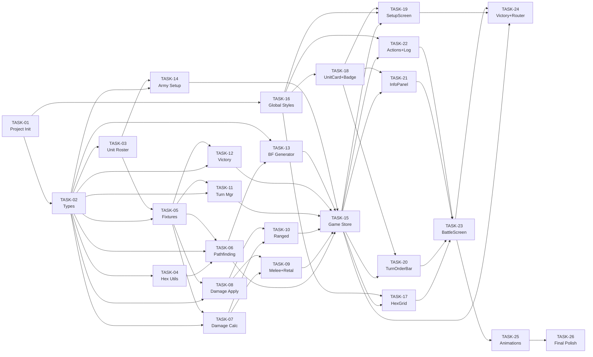

# 07 — Implementation Roadmap: HoMM3 Battle Simulation

> **Inputs**: All previous stage outputs (01 through 06)

---

## Section 1: Project Phasing

| Phase | Name | Goal | Outcome |
|:---|:---|:---|:---|
| 1 | Foundation & Scaffolding | Initialize project, install dependencies, configure tooling, define types | React 19 + Vite app runs with empty shell; all TypeScript interfaces defined |
| 2 | Game Engine Core | Implement pure TypeScript engine (pathfinding, damage, combat, turn management) with unit tests | All engine functions pass tests; no UI yet |
| 3 | Game State Management | Build the centralized Game Store connecting engine to React via Zustand selectors; army setup logic | Store actions and selector hooks drive correct state transitions |
| 4 | Battlefield UI | Render hex grid, hex cells, unit placement, movement highlighting, path preview | Hex grid visible and interactive; movement works visually |
| 5 | Combat UI & Turn Flow | Integrate combat actions, turn order bar, info panel, action buttons, combat log | Full game loop playable from setup to victory |
| 6 | Visual Polish & Animations | Add movement, attack, damage popup, death animations; apply design system fully | Game feels polished with animations and medieval theme |

---

## Section 2: Detailed Task List

### Phase 1: Foundation & Scaffolding

#### `[TASK-01]` Project Initialization

- **Phase**: 1
- **Description**: Scaffold a new React 19 project with Vite. Install TypeScript, Zustand, and Vitest. Configure ESLint and Prettier. Set up the project folder structure from `04_tech_architecture.md` Section 7.
- **Rules Satisfied**: None (infrastructure).
- **Interfaces Consumed**: None.
- **Interfaces Produced**: Folder structure.
- **Tests to Write**: None (verify with `npm run dev` and `npm run test`).
- **Dependencies**: None.
- **Complexity**: Low.
- **Estimated LOC**: 50 (config files).
- **Acceptance Criteria**:
  - [ ] `npm run dev` starts the dev server and the page loads.
  - [ ] `npm run test` runs Vitest with zero tests (passes).
  - [ ] `npm run build` produces a production build without errors.
  - [ ] Folder structure matches `04_tech_architecture.md` Section 7 exactly.

---

#### `[TASK-02]` Type Definitions

- **Phase**: 1
- **Description**: Create `src/lib/types/index.ts` with ALL TypeScript interfaces, enums, and type aliases from `04_tech_architecture.md` Section 3. This includes: `GameState` enum, `ActionType` enum, `PlayerSide` enum, `HexCoord`, `UnitType`, `Stack`, `Player`, `Hex`, `Battlefield`, `TurnOrderQueue`, `CombatLogEntry`, `DamageResult`, `PathResult`, `ArmySlot`, `ArmySelection`, `BattleSummary`, and the `GameAction` union type.
- **Rules Satisfied**: None (infrastructure).
- **Interfaces Consumed**: Entity models from `02_functional_design.md`.
- **Interfaces Produced**: All types exported from `src/lib/types/index.ts`.
- **Tests to Write**: Type-check via `npm run build` (TypeScript strict mode).
- **Dependencies**: TASK-01.
- **Complexity**: Low.
- **Estimated LOC**: 120.
- **Acceptance Criteria**:
  - [ ] Every entity from `02_functional_design.md` Section 1 has a corresponding interface.
  - [ ] Every attribute from each entity table appears in the interface with correct types.
  - [ ] `npm run build` passes with strict mode — zero type errors.
  - [ ] All enums match the spec exactly.

---

#### `[TASK-03]` Unit Roster Data

- **Phase**: 1
- **Description**: Create `src/lib/data/units.ts` with the `UNIT_ROSTER` constant array containing all 6 predefined unit types (Pikeman, Archer, Griffin, Swordsman, Monk, Cavalier) with exact stats from `02_functional_design.md` Entity: `UnitType` table.
- **Rules Satisfied**: Related to EPIC-UNITS-02.
- **Interfaces Consumed**: `UnitType` from TASK-02.
- **Interfaces Produced**: `UNIT_ROSTER: UnitType[]`.
- **Tests to Write**: Unit test verifying roster has 6 entries, each with valid stats.
- **Dependencies**: TASK-02.
- **Complexity**: Low.
- **Estimated LOC**: 50.
- **Acceptance Criteria**:
  - [ ] `UNIT_ROSTER` has exactly 6 entries.
  - [ ] Each entry's stats match `02_functional_design.md` predefined unit roster table.
  - [ ] At least 2 entries have `isRanged: true`.
  - [ ] All entries satisfy type `UnitType` with no type errors.

---

#### `[TASK-04]` Hex Utility Functions

- **Phase**: 1
- **Description**: Create `src/lib/utils/hexUtils.ts` with hex coordinate utility functions: `offsetToCube`, `cubeToOffset`, `hexDistance`, `getHexNeighbors`, `coordToKey` (converts HexCoord to string key like "5,3"), `keyToCoord` (reverse). Follow the odd-r offset layout described in `02_functional_design.md` and `ALGO-01`.
- **Rules Satisfied**: Supports RULE-02 (movement), ALGO-01 (pathfinding).
- **Interfaces Consumed**: `HexCoord` from TASK-02.
- **Interfaces Produced**: Utility functions.
- **Tests to Write**: `tests/utils/hexUtils.spec.ts` — test neighbor calculation for even/odd rows, distance formula, coordinate conversion roundtrip.
- **Dependencies**: TASK-02.
- **Complexity**: Medium.
- **Estimated LOC**: 70.
- **Acceptance Criteria**:
  - [ ] `getHexNeighbors` returns correct 6 neighbors for both even and odd rows.
  - [ ] `hexDistance` matches the cube-coordinate Manhattan distance formula.
  - [ ] `offsetToCube` and `cubeToOffset` are inverse functions (roundtrip test).
  - [ ] Edge hexes (row 0, col 0, row 10, col 14) return only valid in-bounds neighbors.

---

#### `[TASK-05]` Test Fixtures

- **Phase**: 1
- **Description**: Create `tests/fixtures.ts` with all test data from `06_test_strategy.md` Section 7: unit type fixtures, player fixtures, `createStack` factory, `createEmptyBattlefield` factory, and predefined scenarios (SCENARIO_BASIC_MELEE, SCENARIO_RANGED_ATTACK, SCENARIO_SURROUNDED).
- **Rules Satisfied**: None (test infrastructure).
- **Interfaces Consumed**: All types from TASK-02, `UNIT_ROSTER` from TASK-03.
- **Interfaces Produced**: Test fixtures and factories.
- **Tests to Write**: None (fixtures are used by other tests).
- **Dependencies**: TASK-02, TASK-03.
- **Complexity**: Low.
- **Estimated LOC**: 90.
- **Acceptance Criteria**:
  - [ ] All fixtures from `06_test_strategy.md` Section 7 are implemented.
  - [ ] `createStack` returns a valid `Stack` object.
  - [ ] `createEmptyBattlefield` returns a 15×11 grid with no obstacles.
  - [ ] All scenarios produce valid battlefield states.

---

### Phase 2: Game Engine Core

#### `[TASK-06]` A* Pathfinding

- **Phase**: 2
- **Description**: Implement `src/lib/engine/pathfinding.ts` with `findPath` (A* algorithm) and `getReachableHexes` (BFS) per `ALGO-01` and `ALGO-03` from `02_functional_design.md`. Use hex utilities from TASK-04.
- **Rules Satisfied**: RULE-02, ALGO-01, ALGO-03.
- **Interfaces Consumed**: `HexCoord`, `Battlefield`, `Stack` from TASK-02; hex utils from TASK-04.
- **Interfaces Produced**: `findPath`, `getReachableHexes`, `hexDistance`.
- **Tests to Write**: `tests/engine/pathfinding.spec.ts` — all pathfinding tests from `06_test_strategy.md` traceability matrix (shortest path, routing around obstacles, null on blocked, reachable hexes within speed, excluded occupied hexes).
- **Dependencies**: TASK-02, TASK-04, TASK-05.
- **Complexity**: Medium.
- **Estimated LOC**: 120.
- **Acceptance Criteria**:
  - [ ] `findPath` returns shortest path on open grid.
  - [ ] `findPath` routes around obstacles.
  - [ ] `findPath` returns null when fully blocked.
  - [ ] `getReachableHexes` returns only hexes within speed limit.
  - [ ] `getReachableHexes` excludes obstacle and occupied hexes.
  - [ ] Execution time < 5ms on 15×11 grid (benchmark test).

---

#### `[TASK-07]` Damage Calculation

- **Phase**: 2
- **Description**: Implement `src/lib/engine/combat.ts` — Part 1: `calculateDamage` function implementing `ALGO-02` from `02_functional_design.md`. Handles attack/defense modifier with caps, random base damage, creature count multiplier, minimum damage of 1.
- **Rules Satisfied**: ALGO-02, part of RULE-03.
- **Interfaces Consumed**: `Stack`, `DamageResult` from TASK-02.
- **Interfaces Produced**: `calculateDamage` function.
- **Tests to Write**: `tests/engine/combat.spec.ts` — damage formula tests: basic calc, +5%/point, cap at 4.0, -2.5%/point, cap at 0.30, equal stats, minimum 1 damage.
- **Dependencies**: TASK-02, TASK-05.
- **Complexity**: Medium.
- **Estimated LOC**: 70.
- **Acceptance Criteria**:
  - [ ] +5% per attack advantage point, capped at +300%.
  - [ ] -2.5% per defense advantage point, capped at -70%.
  - [ ] Equal stats produce modifier of 1.0.
  - [ ] Minimum damage is always 1.
  - [ ] Damage scales with creature count.

---

#### `[TASK-08]` Damage Application

- **Phase**: 2
- **Description**: Add `applyDamage` to `src/lib/engine/combat.ts` implementing `RULE-05` from `02_functional_design.md`. Handles HP overflow killing multiple creatures, partial damage to top creature, and full stack elimination.
- **Rules Satisfied**: RULE-05.
- **Interfaces Consumed**: `Stack` from TASK-02.
- **Interfaces Produced**: `applyDamage` function.
- **Tests to Write**: `tests/engine/combat.spec.ts` — damage application tests: partial damage, kill cascade, full stack elimination, exact HP kill.
- **Dependencies**: TASK-02, TASK-05.
- **Complexity**: Medium.
- **Estimated LOC**: 40.
- **Acceptance Criteria**:
  - [ ] Partial damage reduces `currentHp` without killing creatures.
  - [ ] Overflow damage kills creatures one-by-one with correct HP reset.
  - [ ] Stack elimination sets `creatureCount = 0` and `currentHp = 0`.
  - [ ] Returns correct `creaturesKilled` count.

---

#### `[TASK-09]` Melee Attack & Retaliation

- **Phase**: 2
- **Description**: Add `meleeAttack` function to `src/lib/engine/combat.ts` implementing `RULE-03` and `RULE-04`. Orchestrates: calculate damage → apply to defender → check if defender alive → if alive and `hasRetaliated == false`, calculate retaliation damage → apply to attacker → set `hasRetaliated = true`.
- **Rules Satisfied**: RULE-03, RULE-04.
- **Interfaces Consumed**: `Stack`, `DamageResult` from TASK-02; `calculateDamage`, `applyDamage` from TASK-07/TASK-08.
- **Interfaces Produced**: `meleeAttack` function.
- **Tests to Write**: `tests/engine/combat.spec.ts` — melee tests: damage + retaliation trigger, no retaliation if defender dies, retaliation once per round, attacker can die from retaliation.
- **Dependencies**: TASK-07, TASK-08.
- **Complexity**: Medium.
- **Estimated LOC**: 50.
- **Acceptance Criteria**:
  - [ ] Melee attack applies damage to defender.
  - [ ] Retaliation fires if defender is alive and hasn't retaliated.
  - [ ] Retaliation uses defender's current (reduced) creature count.
  - [ ] `hasRetaliated` set to true after first retaliation.
  - [ ] No retaliation if defender already retaliated this round.

---

#### `[TASK-10]` Ranged Attack

- **Phase**: 2
- **Description**: Add `rangedAttack` function to `src/lib/engine/combat.ts` implementing `RULE-06`. Calculates damage, applies it, decrements shots. No retaliation on ranged attacks.
- **Rules Satisfied**: RULE-06.
- **Interfaces Consumed**: `Stack` from TASK-02; `calculateDamage`, `applyDamage` from TASK-07/TASK-08.
- **Interfaces Produced**: `rangedAttack` function.
- **Tests to Write**: `tests/engine/combat.spec.ts` — ranged tests: no retaliation, shot decrement, adjacent treated as melee, zero shots blocks ranged.
- **Dependencies**: TASK-07, TASK-08.
- **Complexity**: Low.
- **Estimated LOC**: 30.
- **Acceptance Criteria**:
  - [ ] Ranged attack does not trigger retaliation.
  - [ ] `remainingShots` decrements by 1.
  - [ ] Returns correct damage result.

---

#### `[TASK-11]` Turn Order Management

- **Phase**: 2
- **Description**: Implement `src/lib/engine/turnManager.ts` with: `buildTurnOrder` (sort by initiative, RULE-01), `advanceTurn` (move to next stack), `handleWait` (RULE-08), `handleDefend` (RULE-09), `resetRound` (RULE-10).
- **Rules Satisfied**: RULE-01, RULE-08, RULE-09, RULE-10.
- **Interfaces Consumed**: `Stack`, `TurnOrderQueue` from TASK-02.
- **Interfaces Produced**: `buildTurnOrder`, `advanceTurn`, `handleWait`, `handleDefend`, `resetRound`.
- **Tests to Write**: `tests/engine/turnManager.spec.ts` — initiative sorting, P1-first tiebreak, dead stack exclusion, wait to end of queue, reverse initiative wait order, defend bonus, round reset flags.
- **Dependencies**: TASK-02, TASK-05.
- **Complexity**: Medium.
- **Estimated LOC**: 110.
- **Acceptance Criteria**:
  - [ ] Stacks sorted by initiative descending.
  - [ ] Ties broken: P1 first, then lower row first.
  - [ ] Dead stacks excluded.
  - [ ] Wait moves stack to end of queue with reverse-initiative processing.
  - [ ] Defend sets `isDefending = true` with `effectiveDefense = floor(def * 1.2)`.
  - [ ] Round reset clears all flags.

---

#### `[TASK-12]` Victory Check

- **Phase**: 2
- **Description**: Implement `src/lib/engine/victoryCheck.ts` with `checkVictory` (RULE-07) and `buildBattleSummary`.
- **Rules Satisfied**: RULE-07.
- **Interfaces Consumed**: `Stack`, `Player`, `BattleSummary` from TASK-02.
- **Interfaces Produced**: `checkVictory`, `buildBattleSummary`.
- **Tests to Write**: `tests/engine/victoryCheck.spec.ts` — P2 wins when P1 all dead, P1 wins when P2 all dead, null when both alive.
- **Dependencies**: TASK-02, TASK-05.
- **Complexity**: Low.
- **Estimated LOC**: 50.
- **Acceptance Criteria**:
  - [ ] Returns winning player ID when all opponent stacks dead.
  - [ ] Returns null when both sides alive.
  - [ ] `buildBattleSummary` includes surviving stacks, rounds, damage totals.

---

#### `[TASK-13]` Battlefield Generator

- **Phase**: 2
- **Description**: Implement `src/lib/engine/battlefieldGenerator.ts` with `generateObstacles` (RULE-12) and `deployStacks` (RULE-13). Obstacles: 6-12 random obstacles avoiding deployment zones (cols 0-1, 13-14), with connectivity check using pathfinding from TASK-06.
- **Rules Satisfied**: RULE-12, RULE-13.
- **Interfaces Consumed**: `Battlefield`, `HexCoord`, `Stack`, `Player` from TASK-02; `findPath` from TASK-06.
- **Interfaces Produced**: `generateObstacles`, `deployStacks`.
- **Tests to Write**: `tests/engine/battlefield.spec.ts` — obstacle count in range, no obstacles in deploy zones, connectivity ensured, stacks deployed at correct positions.
- **Dependencies**: TASK-02, TASK-06.
- **Complexity**: Medium.
- **Estimated LOC**: 90.
- **Acceptance Criteria**:
  - [ ] Generates 6-12 obstacles.
  - [ ] No obstacles in columns 0-1 or 13-14.
  - [ ] Path from (0,5) to (14,5) always exists.
  - [ ] P1 stacks deployed at col 0, rows 1/5/9.
  - [ ] P2 stacks deployed at col 14, rows 1/5/9.

---

#### `[TASK-14]` Army Setup Validation

- **Phase**: 2
- **Description**: Implement `src/lib/engine/armySetup.ts` with `validateArmy` (RULE-11), `createStackFromSelection`, and `getDefaultArmy`.
- **Rules Satisfied**: RULE-11.
- **Interfaces Consumed**: `ArmySelection`, `ArmySlot`, `UnitType`, `Stack` from TASK-02; `UNIT_ROSTER` from TASK-03.
- **Interfaces Produced**: `validateArmy`, `createStackFromSelection`, `getDefaultArmy`.
- **Tests to Write**: `tests/engine/armySetup.spec.ts` — requires 3 stacks, positive count, cap at 99, allows duplicates.
- **Dependencies**: TASK-02, TASK-03.
- **Complexity**: Low.
- **Estimated LOC**: 70.
- **Acceptance Criteria**:
  - [ ] Returns false for fewer than 3 stacks.
  - [ ] Returns false for creature count 0.
  - [ ] Clamps count to 1-99.
  - [ ] Allows duplicate unit types.
  - [ ] `getDefaultArmy` returns a valid 3-stack army.

---

### Phase 3: Game State Management

#### `[TASK-15]` Game Store

- **Phase**: 3
- **Description**: Implement `src/lib/state/gameStore.ts` using Zustand. Define the full `AppState` store, implement the action dispatcher that maps `GameAction` types to engine function calls, and expose selector hooks for active stack, reachable hexes, attack targets, and action guards. This is the central orchestrator.
- **Rules Satisfied**: All rules (orchestrates all engine calls).
- **Interfaces Consumed**: All types from TASK-02; all engine functions from TASK-06 through TASK-14.
- **Interfaces Produced**: Zustand `useGameStore` store API with selector hooks + actions.
- **Tests to Write**: `tests/integration/gameStore.spec.ts` — full game flow integration tests: setup → army confirm → battle start → move → attack → victory.
- **Dependencies**: TASK-06 through TASK-14 (all engine tasks).
- **Complexity**: High.
- **Estimated LOC**: 280.
- **Acceptance Criteria**:
  - [ ] State transitions match `02_functional_design.md` Game state machine exactly.
  - [ ] All actions dispatch correctly to engine functions.
  - [ ] Selector-driven derived state updates correctly.
  - [ ] Move-then-attack combo works (RULE-14).
  - [ ] Victory detection triggers on last stack death.
  - [ ] Combat log records all actions.

---

### Phase 4: Battlefield UI

#### `[TASK-16]` Global Styles & Design Tokens

- **Phase**: 4
- **Description**: Create `src/app.css` with all CSS custom properties from `05_design_system.md` Section 2: colors, typography, spacing, border/shadow tokens. Import Google Fonts (Cinzel, Inter, JetBrains Mono). Set body defaults.
- **Rules Satisfied**: None (styling infrastructure).
- **Interfaces Consumed**: Design tokens from `05_design_system.md`.
- **Interfaces Produced**: CSS custom properties available globally.
- **Tests to Write**: Visual verification (manual).
- **Dependencies**: TASK-01.
- **Complexity**: Low.
- **Estimated LOC**: 200.
- **Acceptance Criteria**:
  - [ ] All tokens from `05_design_system.md` are defined as CSS custom properties.
  - [ ] Google Fonts load correctly.
  - [ ] Body background is `--color-bg-primary`.

---

#### `[TASK-17]` HexGrid & HexCell Components

- **Phase**: 4
- **Description**: Create `src/components/HexGrid.tsx` and `src/components/HexCell.tsx`. Render a 15×11 SVG hex grid with flat-top hexes (50px wide). HexCell handles all visual states (empty, occupied, obstacle, reachable, attackable, path, active, hovered). Wire click and hover events to the game store.
- **Rules Satisfied**: EPIC-GRID-01 (US-GRID-01 through US-GRID-08).
- **Interfaces Consumed**: `Battlefield`, `Hex`, `HexCoord`, `Stack` from TASK-02; `gameStore` from TASK-15.
- **Interfaces Produced**: `HexGrid.tsx`, `HexCell.tsx` components.
- **Tests to Write**: Component tests: hex renders in correct state, click emits correct event, hover shows tooltip data.
- **Dependencies**: TASK-15, TASK-16.
- **Complexity**: High.
- **Estimated LOC**: 260 (170 + 90).
- **Acceptance Criteria**:
  - [ ] 165 hexes render in a 15×11 grid with correct spacing.
  - [ ] Obstacle hexes display distinct visual.
  - [ ] Reachable hexes highlight green when stack is active.
  - [ ] Occupied hexes show unit icon and creature count badge.
  - [ ] Click on reachable hex triggers `MOVE_STACK` action.
  - [ ] Click on attackable hex triggers attack action.
  - [ ] Hover shows path preview.

---

#### `[TASK-18]` CreatureCountBadge & UnitCard Components

- **Phase**: 4
- **Description**: Create `src/components/CreatureCountBadge.tsx` and `src/components/UnitCard.tsx` per `05_design_system.md` component specs. UnitCard has full/compact/mini variants.
- **Rules Satisfied**: EPIC-UNITS-02 (US-UNITS-04, US-UNITS-05), EPIC-UI-08 (US-UI-07).
- **Interfaces Consumed**: `UnitType`, `Stack` from TASK-02.
- **Interfaces Produced**: Two reusable components.
- **Tests to Write**: Component tests: correct variant rendering, stat display, low-health coloring.
- **Dependencies**: TASK-16.
- **Complexity**: Medium.
- **Estimated LOC**: 140 (55 + 85).
- **Acceptance Criteria**:
  - [ ] UnitCard full variant shows all 6 stats.
  - [ ] UnitCard compact variant shows icon + name + count.
  - [ ] UnitCard mini variant shows icon only.
  - [ ] CreatureCountBadge turns red below 25% creatures.

---

### Phase 5: Combat UI & Turn Flow

#### `[TASK-19]` Setup Screen

- **Phase**: 5
- **Description**: Create `src/components/SetupScreen.tsx` implementing the army selection interface from `05_design_system.md`. Each player sees the 6-unit roster, selects 3, sets creature counts, and clicks Ready. Includes Default Army button.
- **Rules Satisfied**: EPIC-SETUP-03, RULE-11.
- **Interfaces Consumed**: `ArmySelection`, `UnitType` from TASK-02; `UNIT_ROSTER` from TASK-03; `gameStore` from TASK-15.
- **Interfaces Produced**: `SetupScreen.tsx` component.
- **Tests to Write**: Component tests: unit selection, deselection, count validation, Ready button enable/disable.
- **Dependencies**: TASK-15, TASK-16, TASK-18.
- **Complexity**: Medium.
- **Estimated LOC**: 165.
- **Acceptance Criteria**:
  - [ ] All 6 units rendered with full stat cards.
  - [ ] Clicking a unit card adds to next empty army slot.
  - [ ] Clicking a selected card deselects it.
  - [ ] Creature count input clamped to 1-99.
  - [ ] Ready button disabled until 3 stacks with valid counts.
  - [ ] Default Army button fills all 3 slots.

---

#### `[TASK-20]` TurnOrderBar Component

- **Phase**: 5
- **Description**: Create `src/components/TurnOrderBar.tsx` per `05_design_system.md`. Displays initiative queue as a horizontal bar of mini UnitCards with player color borders.
- **Rules Satisfied**: EPIC-TURNORDER-05 (US-TURN-01 through US-TURN-04).
- **Interfaces Consumed**: `TurnOrderQueue`, `Stack` from TASK-02; `gameStore` from TASK-15.
- **Interfaces Produced**: `TurnOrderBar.tsx` component.
- **Tests to Write**: Component tests: correct count of entries, active highlighted, updates on death/wait.
- **Dependencies**: TASK-15, TASK-18.
- **Complexity**: Low.
- **Estimated LOC**: 70.
- **Acceptance Criteria**:
  - [ ] Displays all living stacks in initiative order.
  - [ ] Active stack has gold border.
  - [ ] Updates when stacks die or wait.
  - [ ] Player color visible on each entry.

---

#### `[TASK-21]` InfoPanel Component

- **Phase**: 5
- **Description**: Create `src/components/InfoPanel.tsx` per `05_design_system.md`. Shows active stack stats or hovered stack stats. Includes HP bar, shot counter, status indicators.
- **Rules Satisfied**: EPIC-UI-08 (US-UI-01, US-UI-02).
- **Interfaces Consumed**: `Stack`, `UnitType` from TASK-02; `gameStore` from TASK-15.
- **Interfaces Produced**: `InfoPanel.tsx` component.
- **Tests to Write**: Component tests: stat display matches stack data, HP bar proportional.
- **Dependencies**: TASK-15, TASK-16, TASK-18.
- **Complexity**: Low.
- **Estimated LOC**: 90.
- **Acceptance Criteria**:
  - [ ] Shows all 6 stats for active stack.
  - [ ] HP bar width proportional to remaining HP.
  - [ ] Shot counter visible for ranged units.
  - [ ] Defend/wait status icons shown when active.

---

#### `[TASK-22]` ActionButtons & CombatLog Components

- **Phase**: 5
- **Description**: Create `src/components/ActionButtons.tsx` and `src/components/CombatLog.tsx` per `05_design_system.md`. Action buttons contextually enable/disable. Combat log auto-scrolls.
- **Rules Satisfied**: EPIC-UI-08 (US-UI-03, US-UI-04, US-UI-05, US-UI-06).
- **Interfaces Consumed**: `CombatLogEntry` from TASK-02; `gameStore` from TASK-15.
- **Interfaces Produced**: Two components.
- **Tests to Write**: Component tests: button enable/disable states, log auto-scroll, entry formatting.
- **Dependencies**: TASK-15, TASK-16.
- **Complexity**: Low.
- **Estimated LOC**: 140 (70 + 70).
- **Acceptance Criteria**:
  - [ ] Wait button disabled if stack already waited.
  - [ ] Attack button disabled if no valid target.
  - [ ] Combat log shows all actions with round separators.
  - [ ] Combat log auto-scrolls to latest entry.

---

#### `[TASK-23]` BattleScreen Layout

- **Phase**: 5
- **Description**: Create `src/components/BattleScreen.tsx` composing HexGrid, TurnOrderBar, InfoPanel, ActionButtons, CombatLog, and PlayerBanner. Layout matches `05_design_system.md` Section 7 battle screen wireframe.
- **Rules Satisfied**: EPIC-UI-08 overall layout.
- **Interfaces Consumed**: `gameStore` from TASK-15.
- **Interfaces Produced**: `BattleScreen.tsx` component.
- **Tests to Write**: Layout rendering test.
- **Dependencies**: TASK-17, TASK-20, TASK-21, TASK-22.
- **Complexity**: Medium.
- **Estimated LOC**: 110.
- **Acceptance Criteria**:
  - [ ] Info panel on left (240px), hex grid center, combat log right (260px).
  - [ ] Turn order bar at top.
  - [ ] Action buttons below the grid.
  - [ ] Round counter visible.
  - [ ] Player turn indicator visible.

---

#### `[TASK-24]` VictoryScreen & App Router

- **Phase**: 5
- **Description**: Create `src/components/VictoryScreen.tsx`, `src/components/ErrorBoundary.tsx`, and update `src/App.tsx` to route between SetupScreen, BattleScreen, and VictoryScreen based on `gameState`. Wrap major UI regions in reusable error boundaries. Victory screen shows summary and a New Game button.
- **Rules Satisfied**: EPIC-VICTORY-07 (US-VICTORY-01 through US-VICTORY-04).
- **Interfaces Consumed**: `BattleSummary`, `GameState` from TASK-02; `gameStore` from TASK-15.
- **Interfaces Produced**: `VictoryScreen.tsx`, `ErrorBoundary.tsx`, updated `App.tsx`.
- **Tests to Write**: Component tests: winner display, summary data, New Game resets state.
- **Dependencies**: TASK-15, TASK-19, TASK-23.
- **Complexity**: Medium.
- **Estimated LOC**: 190 (85 + 60 + 45).
- **Acceptance Criteria**:
  - [ ] Game state SETUP → SetupScreen, BATTLE → BattleScreen, FINISHED → VictoryScreen overlay.
  - [ ] Victory screen shows winner name in player color.
  - [ ] Battle summary: surviving stacks, rounds, damage per player.
  - [ ] New Game button returns to SETUP state.
  - [ ] Root and panel-level error boundaries render fallback UI on render failures.

---

### Phase 6: Visual Polish & Animations

#### `[TASK-25]` Movement & Attack Animations

- **Phase**: 6
- **Description**: Add `src/components/DamagePopup.tsx` and CSS/JS animations per `05_design_system.md` Section 5: movement hex-by-hex (300ms/hex), melee lunge (400ms), ranged projectile (500ms), retaliation lunge (400ms with 200ms delay), damage popup float (1200ms).
- **Rules Satisfied**: EPIC-VISUALS-09 (US-VIS-01 through US-VIS-05).
- **Interfaces Consumed**: `gameStore` from TASK-15.
- **Interfaces Produced**: `DamagePopup.tsx`, animation CSS/logic.
- **Tests to Write**: Manual visual testing checklist from `06_test_strategy.md` Section 9.
- **Dependencies**: TASK-23.
- **Complexity**: Medium.
- **Estimated LOC**: 160 (50 component + 110 animation logic/CSS).
- **Acceptance Criteria**:
  - [ ] Stacks animate smoothly hex-by-hex during movement.
  - [ ] Attack lunge animation plays toward target.
  - [ ] Damage numbers float upward and fade out.
  - [ ] Death animation fades and shrinks stack.
  - [ ] Retaliation animation visually distinct (delayed).
  - [ ] All animations at 60 FPS.

---

#### `[TASK-26]` Final Polish & Active Stack Effects

- **Phase**: 6
- **Description**: Add active stack gold pulse animation, reachable hex subtle glow pulse, hover lift on cards, turn transition crossfade, player banner glow. Final styling pass to ensure all design tokens applied correctly. Replace any placeholder visuals with final styled versions.
- **Rules Satisfied**: All UI epics — final polish.
- **Interfaces Consumed**: `gameStore` from TASK-15; design tokens from TASK-16.
- **Interfaces Produced**: Updated CSS and component styles.
- **Tests to Write**: Complete manual visual testing checklist.
- **Dependencies**: TASK-25.
- **Complexity**: Medium.
- **Estimated LOC**: 110.
- **Acceptance Criteria**:
  - [ ] Active stack hex pulses with gold glow.
  - [ ] Reachable hexes gently pulse.
  - [ ] All colors match `05_design_system.md` token table.
  - [ ] Typography matches spec (Cinzel headings, Inter body, JetBrains Mono stats).
  - [ ] Full game playable from setup to victory with all animations.

---

## Section 3: Task Dependency Graph



---

## Section 4: Complete File Manifest

| File Path | Purpose | Key Exports | Est. LOC | Created by Task |
|:---|:---|:---|:---:|:---|
| `package.json` | Project config | — | 30 | TASK-01 |
| `vite.config.ts` | Vite configuration | — | 20 | TASK-01 |
| `tsconfig.json` | TypeScript config | — | 20 | TASK-01 |
| `.eslintrc.cjs` | ESLint config | — | 20 | TASK-01 |
| `.prettierrc` | Prettier config | — | 5 | TASK-01 |
| `src/vite-env.d.ts` | Vite TypeScript env declarations | — | 5 | TASK-01 |
| `index.html` | Entry HTML | — | 15 | TASK-01 |
| `src/main.tsx` | App entry point | — | 15 | TASK-01 |
| `src/app.css` | Global styles + design tokens | CSS custom properties | 200 | TASK-16 |
| `src/App.tsx` | Root component, state router | — | 45 | TASK-24 |
| `src/components/ErrorBoundary.tsx` | Reusable render-fallback wrapper | `ErrorBoundary` | 60 | TASK-24 |
| `src/lib/types/index.ts` | All TypeScript interfaces/enums | All types | 120 | TASK-02 |
| `src/lib/data/units.ts` | Unit roster data | `UNIT_ROSTER` | 50 | TASK-03 |
| `src/lib/utils/hexUtils.ts` | Hex coordinate utilities | `offsetToCube`, `getHexNeighbors`, `hexDistance` | 60 | TASK-04 |
| `src/lib/engine/pathfinding.ts` | A* pathfinding + reachable hexes | `findPath`, `getReachableHexes` | 120 | TASK-06 |
| `src/lib/engine/combat.ts` | Damage calc, melee, ranged, retaliation | `calculateDamage`, `applyDamage`, `meleeAttack`, `rangedAttack` | 150 | TASK-07/08/09/10 |
| `src/lib/engine/turnManager.ts` | Turn ordering, wait, defend, round reset | `buildTurnOrder`, `advanceTurn`, `handleWait`, `handleDefend`, `resetRound` | 100 | TASK-11 |
| `src/lib/engine/victoryCheck.ts` | Victory detection + summary | `checkVictory`, `buildBattleSummary` | 50 | TASK-12 |
| `src/lib/engine/battlefieldGenerator.ts` | Obstacle generation + deployment | `generateObstacles`, `deployStacks` | 80 | TASK-13 |
| `src/lib/engine/armySetup.ts` | Army validation + defaults | `validateArmy`, `createStackFromSelection`, `getDefaultArmy` | 60 | TASK-14 |
| `src/lib/state/gameStore.ts` | Zustand game state + dispatcher | `useGameStore` | 280 | TASK-15 |
| `src/components/HexGrid.tsx` | SVG hex grid renderer | — | 170 | TASK-17 |
| `src/components/HexCell.tsx` | Individual hex with interactions | — | 90 | TASK-17 |
| `src/components/UnitCard.tsx` | Unit type display (3 variants) | — | 85 | TASK-18 |
| `src/components/CreatureCountBadge.tsx` | Creature count overlay | — | 55 | TASK-18 |
| `src/components/SetupScreen.tsx` | Army selection interface | — | 165 | TASK-19 |
| `src/components/TurnOrderBar.tsx` | Initiative queue display | — | 70 | TASK-20 |
| `src/components/InfoPanel.tsx` | Stack stat panel | — | 90 | TASK-21 |
| `src/components/ActionButtons.tsx` | Wait/Defend/Attack buttons | — | 70 | TASK-22 |
| `src/components/CombatLog.tsx` | Scrollable action log | — | 70 | TASK-22 |
| `src/components/BattleScreen.tsx` | Battle layout container | — | 110 | TASK-23 |
| `src/components/VictoryScreen.tsx` | Victory overlay | — | 85 | TASK-24 |
| `src/components/DamagePopup.tsx` | Floating damage numbers | — | 50 | TASK-25 |
| `tests/fixtures.ts` | Test data + factories | All fixtures | 80 | TASK-05 |
| `tests/utils/hexUtils.spec.ts` | Hex utility tests | — | 60 | TASK-04 |
| `tests/engine/pathfinding.spec.ts` | Pathfinding tests | — | 100 | TASK-06 |
| `tests/engine/combat.spec.ts` | Combat engine tests | — | 200 | TASK-07/08/09/10 |
| `tests/engine/turnManager.spec.ts` | Turn management tests | — | 100 | TASK-11 |
| `tests/engine/victoryCheck.spec.ts` | Victory check tests | — | 40 | TASK-12 |
| `tests/engine/battlefield.spec.ts` | Battlefield generation tests | — | 80 | TASK-13 |
| `tests/engine/armySetup.spec.ts` | Army setup validation tests | — | 50 | TASK-14 |
| `tests/integration/gameStore.spec.ts` | Integration flow tests | — | 180 | TASK-15 |
| **TOTAL** | | | **~3,500** | |

---

## Section 5: Bootstrapping Commands

```bash
# Step 1: Create the React + Vite project
npm create vite@latest . -- --template react-ts

# Step 2: Install base dependencies
npm install
npm install zustand

# Step 3: Install testing dependencies
npm install -D vitest @testing-library/react @testing-library/user-event jsdom

# Step 4: Configure Vitest — add to vite.config.ts:
# import react from '@vitejs/plugin-react'
# import { defineConfig } from 'vitest/config'
# export default defineConfig({
#   plugins: [react()],
#   test: { environment: 'jsdom', include: ['tests/**/*.spec.ts', 'tests/**/*.spec.tsx'] }
# })

# Step 5: Verify dev server
npm run dev

# Step 6: Verify test runner
npm run test

# Step 7: Verify production build
npm run build
```

---

## Section 6: Execution Instructions for AI Agent

### Task Execution Protocol

Execute tasks in strict dependency order (see Section 3 graph). For each task:

1. **Read** the task's description, acceptance criteria, and referenced rules/sections.
2. **Read** the exact TypeScript interfaces from `04_tech_architecture.md` Section 3 that the task consumes.
3. **Read** the exact test specifications from `06_test_strategy.md` Sections 2-3 for the rules being implemented.
4. **Write the test first** (TDD): create the test file with all test cases from the proto-tests. Run the tests — they should fail.
5. **Write the implementation**: implement the function/component to pass all tests.
6. **Run tests**: verify all tests pass. Fix any failures before proceeding.
7. **Run type-check**: `npm run build` must pass with zero errors.
8. **Move to next task** only when all acceptance criteria are checked off.

### Quality Rules

- All TypeScript interfaces must match `04_tech_architecture.md` Section 3 **exactly** — do not add, remove, or rename fields.
- All component props must match `05_design_system.md` component specs exactly.
- All business logic must implement `[RULE-XX]` from `02_functional_design.md` exactly — including edge cases.
- All design tokens must use the exact CSS custom property names and values from `05_design_system.md` Section 2.
- If a task's acceptance criteria cannot be met, **STOP** and report the issue rather than improvising.

### Deviation Policy

If at any point the implementing agent encounters a situation not covered by the blueprint (a missing edge case, an ambiguous rule, a design gap), it must:
1. Document the gap clearly.
2. Propose a solution consistent with the existing patterns.
3. Wait for approval before implementing the proposed solution.
4. Never silently improvise — every deviation must be documented in the combat log of development decisions.


